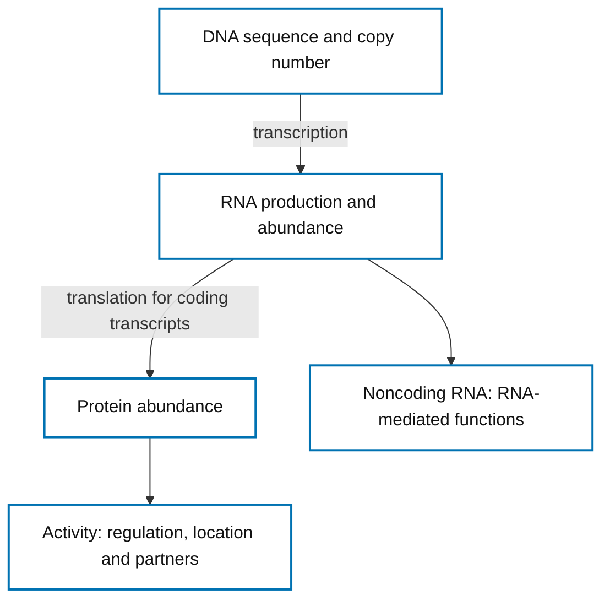
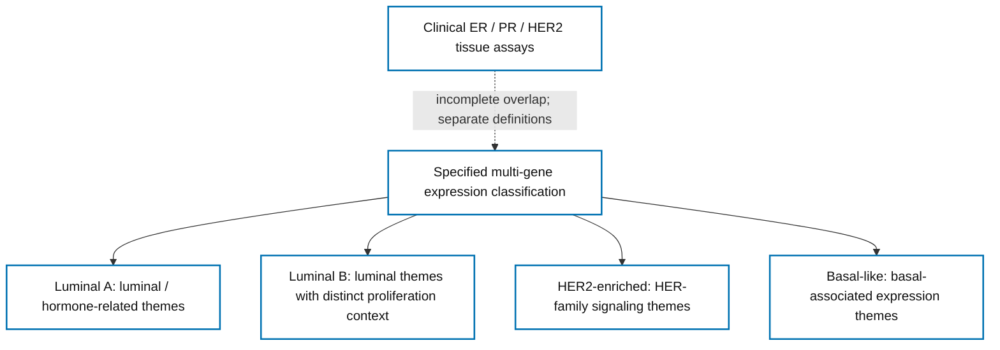
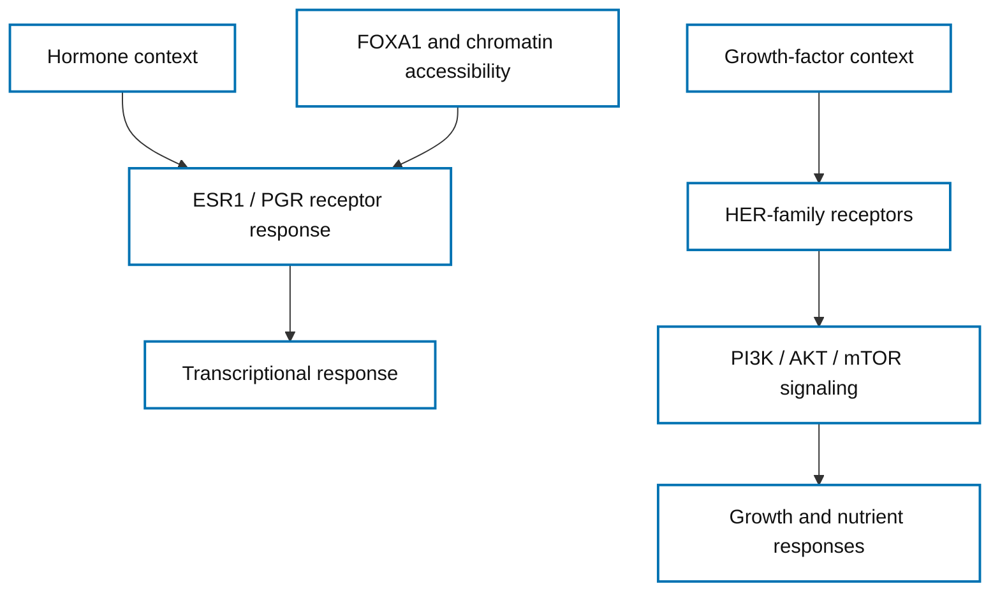
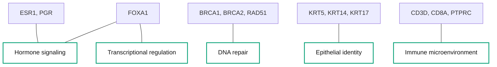
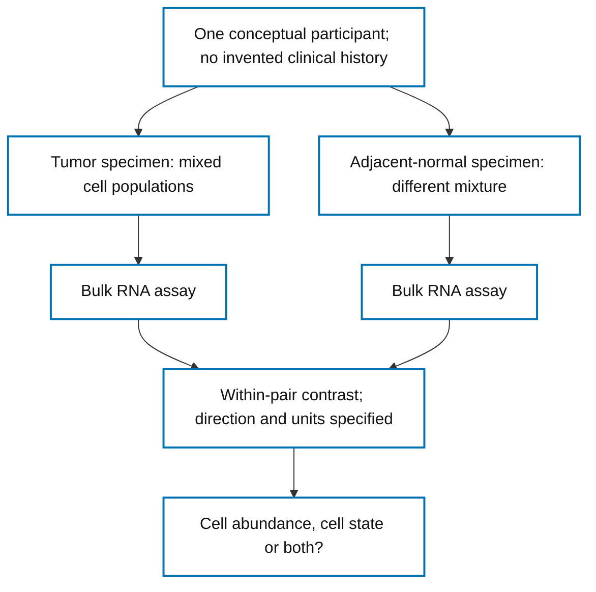
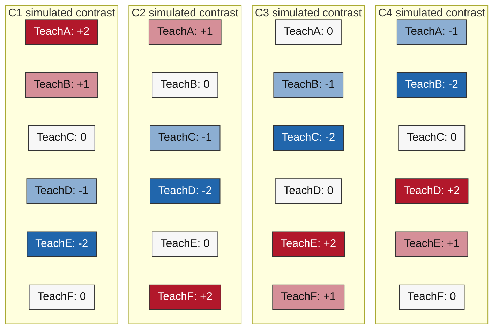
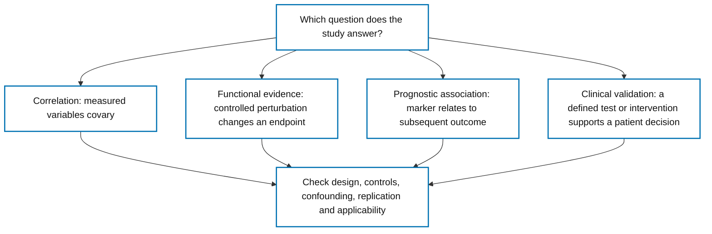

# Breast Cancer Research Guide — People, Data, Biology and 60 Genes

[Paul's Notes](../../README.md) · [Resources](../README.md) · [Focused references](README.md)

Original educational guide · Editorial version `UNIFIED_GUIDE_V1` · Annotation and literature snapshot 2026-10-10.

Read continuously below, or choose a route into this same guide. Every numerical example is invented; conceptual diagrams carry no patient measurements.

## Contents

1. [The People Behind the Numbers](#chapter-1-the-people-behind-the-numbers)
2. [Understanding the Breast Cancer Dataset](#chapter-2-understanding-the-breast-cancer-dataset)
3. [How Researchers Measure Genes](#chapter-3-how-researchers-measure-genes)
4. [Why Tumors Behave Differently](#chapter-4-why-tumors-behave-differently)
5. [The Biology Behind the 60 Genes](#chapter-5-the-biology-behind-the-60-genes)
6. [The Integrated 60-Gene Atlas](#chapter-6-the-integrated-60-gene-atlas)
7. [From Genes to Biological Pathways](#chapter-7-from-genes-to-biological-pathways)
8. [From Measurements to Scientific Evidence](#chapter-8-from-measurements-to-scientific-evidence)
9. [Reading the Scientific Figures](#chapter-9-reading-the-scientific-figures)
10. [What the Data Cannot Tell Us](#chapter-10-what-the-data-cannot-tell-us)
11. [Working Through a Research Question](#chapter-11-working-through-a-research-question)
12. [Research Practice, References and Next Steps](#chapter-12-research-practice-references-and-next-steps)

## Guided learning routes

- **Beginner:** [The People Behind the Numbers](#chapter-1-the-people-behind-the-numbers) → [Understanding the Breast Cancer Dataset](#chapter-2-understanding-the-breast-cancer-dataset) → [How Researchers Measure Genes](#chapter-3-how-researchers-measure-genes) → [The Biology Behind the 60 Genes](#chapter-5-the-biology-behind-the-60-genes) → [Working Through a Research Question](#chapter-11-working-through-a-research-question).
- **Biology-focused reader:** [Why Tumors Behave Differently](#chapter-4-why-tumors-behave-differently) → [The Biology Behind the 60 Genes](#chapter-5-the-biology-behind-the-60-genes) → [The Integrated 60-Gene Atlas](#chapter-6-the-integrated-60-gene-atlas) → [From Genes to Biological Pathways](#chapter-7-from-genes-to-biological-pathways) → [What the Data Cannot Tell Us](#chapter-10-what-the-data-cannot-tell-us).
- **Research-focused reader:** [Understanding the Breast Cancer Dataset](#chapter-2-understanding-the-breast-cancer-dataset) → [How Researchers Measure Genes](#chapter-3-how-researchers-measure-genes) → [From Measurements to Scientific Evidence](#chapter-8-from-measurements-to-scientific-evidence) → [Reading the Scientific Figures](#chapter-9-reading-the-scientific-figures) → [What the Data Cannot Tell Us](#chapter-10-what-the-data-cannot-tell-us) → [Research Practice, References and Next Steps](#chapter-12-research-practice-references-and-next-steps).

## Chapter 1: The People Behind the Numbers

A diagnosis changes daily life: appointments, uncertainty, relationships, employment and care all matter. Research begins with that human purpose. Molecular tables offer a limited view of a specimen; they do not summarize a person's experience or determine their future. We use population estimates to understand the scale of the need, while respecting the people represented by each observation.

The **2024 global estimates** distinguish three different quantities:

| Measure | Estimate | Population and meaning |
|---|---:|---|
| Annual incidence | 2,434,087 | Women; new breast cancer diagnoses during 2024 |
| Annual mortality | 693,660 | Women; deaths attributed to breast cancer during 2024 |
| Five-year prevalence | 8,162,335 | Both sexes; people alive in 2024 diagnosed within approximately the preceding five years |

These are modeled estimates, not a live participant registry. Annual deaths are not deaths among exactly that year's newly diagnosed people. Five-year prevalence excludes survivors diagnosed longer ago; **total survivors cannot be inferred from it**. The incidence/mortality population differs from the prevalence population. Sources accessed 10 October 2026: [IARC incidence](https://gco.iarc.who.int/today/en/dataviz/tables?cancers=20&mode=population&sexes=2&types=0), [IARC mortality](https://gco.iarc.who.int/today/en/dataviz/tables?cancers=20&mode=population&sexes=2&types=1), [IARC prevalence](https://gco.iarc.who.int/today/en/dataviz/tables-prevalence?cancers=20&mode=population&types=2) and [2024 global statistics paper](https://acsjournals.onlinelibrary.wiley.com/doi/10.3322/caac.70090).

Access to timely diagnosis and treatment varies across communities. A molecular research cohort cannot by itself explain those differences or represent everyone affected. [WHO breast cancer overview](https://www.who.int/news-room/fact-sheets/detail/breast-cancer) supplies public-health context. Better biological explanations must ultimately be evaluated alongside access, outcomes and the priorities of people receiving care. To understand what one study can contribute, we first need to understand how its dataset was assembled.

[Return to contents](#contents) · [Next chapter](#chapter-2-understanding-the-breast-cancer-dataset)

## Chapter 2: Understanding the Breast Cancer Dataset

**The Cancer Genome Atlas (TCGA)** characterized tumors using several molecular technologies. **TCGA-BRCA** names its breast invasive carcinoma project. This resource lets researchers compare measurements across tumors and ask how molecular differences relate to a defined question. It is a research collection, not a population survey. The [GDC project API](https://api.gdc.cancer.gov/projects/TCGA-BRCA?expand=summary) snapshot accessed **10 October 2026** reported **1,098 cases**. That project-level figure is neither a complete-pair count nor the size of a separate study subset; holdings can change. [NCI guidance on TCGA](https://www.cancer.gov/ccg/research/genome-sequencing/tcga/using-tcga-data).

Follow the chain of observation units before counting:

| Unit | Meaning in a research workflow |
|---|---|
| Patient / participant | The person contributing material under the applicable consent |
| Case | A project record representing a participant; verify the project's mapping |
| Specimen | Tissue obtained at a particular collection event or location |
| Sample | Material selected or processed for an assay; terminology depends on the archive |
| Sequencing library | Prepared molecules submitted to sequencing; several can derive from one specimen |
| Data file | Stored output from an assay or processing step; many files can describe one sample |

Do not count files as independent people. A matched comparison requires verified links between the two specimens and their participant, with a defined rule for duplicates. Tumor-adjacent normal tissue and tissue from a separate unaffected donor are different controls. “Normal” describes a sampling definition; it does not guarantee identical composition, exposure or molecular state.

Ethical collection, consent and controlled access govern permissible uses. Public documentation or summary metadata does not authorize unrestricted release of sensitive records. A reproducible analysis records source version, inclusion rules, identity linkage and processing choices without publishing identifiers. This guide contains no participant-level TCGA data. Once the observational units are clear, the next question is what the assay actually measures.

[Previous chapter](#chapter-1-the-people-behind-the-numbers) · [Return to contents](#contents) · [Next chapter](#chapter-3-how-researchers-measure-genes)

## Chapter 3: How Researchers Measure Genes

### Start learning

**DNA** stores sequence information. **Transcription** produces RNA from selected DNA regions; **translation** uses protein-coding RNA to make proteins. Some RNAs, including MALAT1, function without encoding a protein. **Gene expression** describes production or abundance in a specified context. It does not mean that every step from DNA to biological activity changes together.

RNA sequencing samples fragments derived from RNA. A **raw count** records assigned sequencing evidence under a defined pipeline; it depends on sequencing depth, assignment rules and the tissue mixture. **Normalization** makes a specified comparison more interpretable by addressing technical scale or composition. It does not remove all confounding. TPM and other normalized quantities are not raw counts and must not be substituted for them in a count model.

#### Figure 1: DNA to protein



**Figure 1 caption.** Conceptual relationship among sequence, transcription, translation and function; arrows describe processes, not measured correlations. RNA stability and protein turnover also affect abundance. Noncoding transcripts such as MALAT1 do not follow a protein-coding translation route. **Inputs:** independently drawn process schematic; no numerical units. **Sources:** the public NCBI functional records on [ESR1](GENE_CARDS/ESR1.md) and [MALAT1](GENE_CARDS/MALAT1.md); [multi-platform TCGA study](https://pubmed.ncbi.nlm.nih.gov/23000897/).

**Text equivalent:** DNA is transcribed into RNA. Coding RNA can be translated into protein, whose activity depends on regulation, location and partners. Noncoding RNA has a separate RNA-function branch.

### A worked measurement example

Invent two comparable normalized measurements: 20 units in a simulated tumor preparation and 10 in its simulated comparator. Their ratio is 2, and **log2 fold change** is log2(20/10) = +1. Reversing the comparison yields −1. A value of +2 would describe a fourfold ratio, not two additional molecules. These chosen numbers have no sampling uncertainty, significance or biological discovery attached. Zero denominators require a prospectively specified method; adding a constant changes the estimand and must be disclosed.

A **variant** changes DNA sequence; **copy number** concerns genomic dosage. Neither is established by high RNA. Total protein, protein localization and activation-related assays answer further questions. Clinical ER, PR and HER2 results use defined pathology methods and criteria; a transcript value is not the corresponding clinical result. [NCI biomarker testing](https://www.cancer.gov/types/breast/diagnosis/breast-cancer-biomarker-tests).

### Working glossary

- **Abundance:** how much of a specified molecule is measured, on a stated scale.
- **Activation:** a functional state assessed through an appropriate activity-related measurement.
- **Bulk tissue:** an assay combining molecular contributions from multiple cells.
- **Contrast:** a specified comparison, including its numerator, denominator and units.
- **Confounding:** a factor associated with the comparison and outcome that can distort interpretation.
- **Perturbation:** a deliberate intervention used to investigate a biological response.
- **Calibration:** checking whether a statistical procedure behaves as promised under relevant conditions.

Use this [glossary](#working-glossary) when reading the gene profiles; a [focused measurement reference](GENE_EXPRESSION_INTERPRETATION.md#glossary) provides additional terms. Having separated measurements, we can now examine why tumors do not share one molecular pattern.

[Previous chapter](#chapter-2-understanding-the-breast-cancer-dataset) · [Return to contents](#contents) · [Next chapter](#chapter-4-why-tumors-behave-differently)

## Chapter 4: Why Tumors Behave Differently

Breast tumors can share an anatomical diagnosis while differing in differentiation, proliferation and signaling. **Molecular heterogeneity** means those differences are biologically structured rather than one universal expression pattern. Multi-gene classifiers summarize selected patterns; they do not capture every feature of every cell.

**Luminal A** emphasizes luminal differentiation and hormone-associated expression themes. **Luminal B** retains luminal themes but differs in proliferation and other aspects of its expression program. **HER2-enriched** describes an expression-defined group with HER-family signaling themes. **Basal-like** describes basal-associated expression patterns. These plain-language themes introduce the categories; they are not a decision rule based on one marker. [Parker classifier study](https://pubmed.ncbi.nlm.nih.gov/19204204/) and [TCGA multi-platform study](https://pubmed.ncbi.nlm.nih.gov/23000897/) are primary readings, reviewed here at abstract level.

#### Figure 4: Molecular subtype overview



**Figure 4 caption.** Conceptual biological themes, not a single-gene decision tree or an exhaustive classification algorithm. HER2-enriched is not identical to clinical HER2-positive; basal-like is not identical to triple-negative. Neither RNA from this catalog nor a theme assigns a person's subtype. **Inputs:** original overview of classifier and multi-platform study concepts; no numerical units. **Sources:** [Parker classifier development](https://pubmed.ncbi.nlm.nih.gov/19204204/) and [TCGA](https://pubmed.ncbi.nlm.nih.gov/23000897/); review extent is recorded in the [evidence matrix](REFERENCES/GENE_EVIDENCE_MATRIX.md).

**Text equivalent:** A specified multi-gene classification connects to four expression themes. A dashed line marks incomplete overlap with separate clinical ER/PR/HER2 assays.

**PAM50** uses a defined multi-gene expression method. Clinical ER, PR and HER2 categories use separate tissue assays. HER2-enriched and HER2-positive overlap incompletely; basal-like and triple-negative also differ. This 60-gene teaching catalog is neither PAM50 nor a validated diagnostic classifier.

A bulk specimen includes epithelial, immune and stromal cells. Higher CD8A can reflect more contributing T cells, higher expression within them, or both. Higher COL1A1 can reflect stromal content rather than a tumor-cell program. Cell-resolved and spatial methods help distinguish source populations and location. The [tumor atlas](https://pubmed.ncbi.nlm.nih.gov/34493872/) and [normal breast atlas](https://pubmed.ncbi.nlm.nih.gov/38548988/) provide study-specific context; their specimen definitions are not interchangeable. The following biological systems connect these cell and measurement distinctions to the gene atlas.

[Previous chapter](#chapter-3-how-researchers-measure-genes) · [Return to contents](#contents) · [Next chapter](#chapter-5-the-biology-behind-the-60-genes)

## Chapter 5: The Biology Behind the 60 Genes

Cells maintain identity, respond to signals, divide, repair damage and interact with neighboring cells. The ten connected lessons below follow those tasks. Their gene links point to profiles within this guide. Shared processes can motivate an experiment; they do not establish direct molecular interactions in a particular tumor.

### Cellular identity and differentiation

Cell identity is maintained through coordinated structural and regulatory programs. Luminal-associated and basal-associated keratins help describe epithelial states. A specimen containing several cell states can express both sets; one keratin does not assign a tumor subtype. Differentiation establishes the context in which incoming signals are interpreted.

Starting profiles: [KRT8](#krt8) · [KRT18](#krt18) · [KRT5](#krt5) · [KRT14](#krt14) · [KRT17](#krt17) · [GATA3](#gata3).

### Hormone and growth-factor signaling

Hormone receptors link ligand and chromatin context to transcription. Membrane growth receptors communicate through intracellular signaling systems. Receptor abundance, receptor partners and protein activation are distinct measurements. Equal receptor RNA in two cultures can coexist with different responses after a controlled ligand exposure. Signals can influence the cell-cycle machinery discussed next.

Starting profiles: [ESR1](#esr1) · [PGR](#pgr) · [FOXA1](#foxa1) · [ERBB2](#erbb2) · [PIK3CA](#pik3ca) · [AKT1](#akt1) · [MTOR](#mtor).

### Cell proliferation and checkpoints

Cyclins and kinases coordinate progression through the cell cycle; checkpoint systems constrain that progression. MKI67 is associated with cycling cells. More cycling-cell marker RNA can reflect a greater fraction of cycling cells rather than faster division by each cell. DNA synthesis labeling and microscopy address complementary questions about proliferation.

Starting profiles: [MKI67](#mki67) · [CCND1](#ccnd1) · [CCNE1](#ccne1) · [CDK4](#cdk4) · [CDK6](#cdk6) · [RB1](#rb1) · [CDKN1A](#cdkn1a).

### DNA damage and repair

Damage responses detect disruption and organize repair. Homologous-recombination machinery helps preserve sequence information during division. An abundant transcript can encode a defective protein when a damaging variant is present. Sequence interpretation and a suitable functional assay are needed to evaluate that possibility; unchanged RNA cannot exclude an inherited variant.

Starting profiles: [ATM](#atm) · [CHEK2](#chek2) · [BRCA1](#brca1) · [BRCA2](#brca2) · [PALB2](#palb2) · [RAD51](#rad51) · [BARD1](#bard1).

### Cell survival and death

Checkpoint signaling, growth brakes and regulated cell death affect whether a stressed cell survives. BCL2 and BAX contribute to opposing survival processes, while TP53 and PTEN address different control systems. Exposure, timing and protein state matter. A survival phenotype is an endpoint to test rather than a direct reading of one transcript.

Starting profiles: [TP53](#tp53) · [PTEN](#pten) · [BCL2](#bcl2) · [BAX](#bax).

### Tissue architecture and adhesion

Junctions and matrix attachment organize cells into tissues. Lower bulk CDH1 can result from fewer epithelial cells even when remaining cells retain junctions. Protein localization and histology help distinguish tissue composition from altered adhesion. Architecture provides the setting for interactions with extracellular material.

Starting profiles: [CDH1](#cdh1) · [EPCAM](#epcam) · [ITGA6](#itga6) · [KRT19](#krt19).

### Invasion and extracellular matrix

Collagen and fibronectin help form the extracellular framework; remodeling enzymes and cell states can alter that environment. Fibroblasts and other stromal cells contribute important signals. More matrix RNA does not identify its producing cell or prove invasion. MMP9 abundance does not establish activated proteolysis; localization and activity assays address the specific claim.

Starting profiles: [COL1A1](#col1a1) · [FN1](#fn1) · [MMP9](#mmp9) · [VIM](#vim) · [CXCL12](#cxcl12).

### Immune microenvironment

Immune populations communicate and respond within the tissue. Lineage-associated transcripts can reflect numbers of contributing cells, while checkpoint transcripts can come from different compartments. A CD8A increase does not by itself demonstrate effective killing. Spatial identity, activation and functional endpoints are needed to distinguish recruitment from effective response.

Starting profiles: [CD3D](#cd3d) · [CD8A](#cd8a) · [CD68](#cd68) · [PTPRC](#ptprc) · [PDCD1](#pdcd1) · [CD274](#cd274) · [STAT1](#stat1).

### Metabolism and cellular stress

Nutrient uptake, oxygen responses and protein-folding stress influence cellular adaptation. Transporter RNA does not measure glucose flux. Protein stability can regulate HIF1A, and XBP1 splicing can change while total RNA remains similar. Direct metabolic, protein or isoform measurements complement gene-level abundance.

Starting profiles: [SLC2A1](#slc2a1) · [HIF1A](#hif1a) · [XBP1](#xbp1).

### Transcriptional regulation and emerging mechanisms

Transcription factors act within chromatin and cofactor contexts; correlated transcripts do not prove a regulatory edge. Noncoding RNA adds mechanisms that need not involve translation. MALAT1 has opposing findings across perturbation models and disease contexts. Compare rescue, neighboring-gene effects, host context and endpoint before assigning one universal direction.

Starting profiles: [GATA3](#gata3) · [FOXA1](#foxa1) · [FOXC1](#foxc1) · [STAT1](#stat1) · [MALAT1](#malat1).

#### Figure 2: Epithelial signaling



**Figure 2 caption.** Conceptual, simplified epithelial signaling framework. These are process-level links, not a complete wiring diagram or evidence that every receptor signals identically in every tumor. Ligand, receptor partners, protein activation and cell context matter. **Inputs:** original schematic from the [hormone and growth lessons](GENE_BIOLOGY_LEARNING_GUIDE.md); no numerical units. **Sources:** [FOXA1 functional study](https://pubmed.ncbi.nlm.nih.gov/21151129/) and the NCBI records on [ERBB2](GENE_CARDS/ERBB2.md), [PIK3CA](GENE_CARDS/PIK3CA.md), [AKT1](GENE_CARDS/AKT1.md) and [MTOR](GENE_CARDS/MTOR.md).

**Text equivalent:** Hormone context and FOXA1/chromatin context feed receptor response and transcription. A separate growth-factor branch connects HER-family receptors to PI3K/AKT/mTOR and growth/nutrient responses; this is a process framework.

These processes overlap: a stress response can affect transcription, while tissue composition changes apparent immune or matrix abundance. The original **12 teaching domains** remain available in the [structured domain index](GENE_ATLAS_INDEX.md#by-biological-domain). They are organizational categories, not mutually exclusive pathways. We next examine individual genes using the same distinction between normal function, study findings and measurement limits.

[Previous chapter](#chapter-4-why-tumors-behave-differently) · [Return to contents](#contents) · [Next chapter](#chapter-6-the-integrated-60-gene-atlas)

## Chapter 6: The Integrated 60-Gene Atlas

### Explore the catalog

This atlas retains **21 foundational genes and 39 additions**, with exactly 60 HGNC-approved identities. It is a public teaching selection, not the private project's frozen signature, a prognostic score or a validated clinical assay. The [selection rubric](REFERENCES/SELECTION_RUBRIC.md) explains the teaching rationale.

Each profile derives its function, study finding and specific limitation from the same curated catalog as its complete card. Annotation was cross-checked against HGNC, NCBI Gene and Ensembl on **2026-10-10**. That identity state is `ANNOTATION_VERIFIED`. Literature review remains **`ABSTRACT_ONLY`**: bibliographic records and abstracts were reviewed, but full methods, supplements and results were not independently audited. The primary-paper link beside each account identifies its evidence; the full card records design, model, identifiers and further caveats. A randomized trial context does not turn a gene transcript into a clinical selection test.

### Alphabetical gene lookup

Choose a symbol to jump to its integrated profile. Profiles are grouped by biological topic, with one entry per gene even when several domain memberships apply.

| Gene | Biological role |
|---|---|
| [AKT1](#akt1) | signaling kinase |
| [ATM](#atm) | DNA-damage sensor kinase |
| [AURKA](#aurka) | mitotic kinase |
| [BARD1](#bard1) | DNA-repair partner |
| [BAX](#bax) | cell-death regulator |
| [BCL2](#bcl2) | cell-survival regulator |
| [BRCA1](#brca1) | DNA-repair coordinator |
| [BRCA2](#brca2) | DNA-repair coordinator |
| [CCNB1](#ccnb1) | cell-cycle cyclin |
| [CCND1](#ccnd1) | cell-cycle cyclin |
| [CCNE1](#ccne1) | cell-cycle cyclin |
| [CD274](#cd274) | immune-regulatory ligand |
| [CD3D](#cd3d) | T-cell receptor complex component |
| [CD68](#cd68) | lysosome-associated glycoprotein |
| [CD8A](#cd8a) | immune-cell coreceptor |
| [CDC20](#cdc20) | protein-degradation regulator |
| [CDH1](#cdh1) | cell-adhesion protein |
| [CDK4](#cdk4) | cell-cycle kinase |
| [CDK6](#cdk6) | cell-cycle kinase |
| [CDKN1A](#cdkn1a) | cell-cycle inhibitor |
| [CHEK2](#chek2) | checkpoint kinase |
| [COL1A1](#col1a1) | extracellular matrix protein |
| [CXCL12](#cxcl12) | secreted chemokine |
| [EGFR](#egfr) | growth-factor receptor |
| [EPCAM](#epcam) | epithelial surface protein |
| [ERBB2](#erbb2) | growth-signaling receptor |
| [ERBB3](#erbb3) | receptor signaling partner |
| [ERBB4](#erbb4) | growth-factor receptor |
| [ESR1](#esr1) | hormone-responsive transcription factor |
| [FGFR1](#fgfr1) | growth-factor receptor |
| [FN1](#fn1) | extracellular matrix glycoprotein |
| [FOXA1](#foxa1) | pioneer transcription factor |
| [FOXC1](#foxc1) | transcription factor |
| [GATA3](#gata3) | lineage-regulating transcription factor |
| [HIF1A](#hif1a) | oxygen-response transcription factor |
| [ITGA6](#itga6) | cell-matrix receptor subunit |
| [KRT14](#krt14) | structural intermediate-filament protein |
| [KRT17](#krt17) | structural intermediate-filament protein |
| [KRT18](#krt18) | structural intermediate-filament protein |
| [KRT19](#krt19) | structural intermediate-filament protein |
| [KRT5](#krt5) | structural intermediate-filament protein |
| [KRT8](#krt8) | structural intermediate-filament protein |
| [MALAT1](#malat1) | long noncoding RNA |
| [MKI67](#mki67) | chromosome-associated proliferation protein |
| [MMP9](#mmp9) | matrix-remodeling enzyme |
| [MTOR](#mtor) | nutrient-responsive kinase |
| [PALB2](#palb2) | DNA-repair scaffold |
| [PDCD1](#pdcd1) | immune-inhibitory receptor |
| [PGR](#pgr) | hormone-responsive transcription factor |
| [PIK3CA](#pik3ca) | lipid-signaling enzyme |
| [PTEN](#pten) | lipid-signaling phosphatase |
| [PTPRC](#ptprc) | immune signaling phosphatase |
| [RAD51](#rad51) | DNA recombinase |
| [RB1](#rb1) | transcriptional cell-cycle gatekeeper |
| [SLC2A1](#slc2a1) | glucose transporter |
| [STAT1](#stat1) | signal-responsive transcription factor |
| [TOP2A](#top2a) | DNA topology enzyme |
| [TP53](#tp53) | stress-response transcription factor |
| [VIM](#vim) | structural intermediate-filament protein |
| [XBP1](#xbp1) | stress-response transcription factor |

### Atlas: Hormone signaling

#### ESR1

**estrogen receptor 1**. The encoded product is hormone-responsive transcription factor. ESR1 encodes estrogen receptor alpha, which helps regulate gene transcription in response to hormonal and cellular context. Access to DNA and cooperating proteins influence which targets respond.

Research focus: Relate luminal transcription to receptor biology while separating clinical protein status from RNA. Study context: Primary breast tumors across intrinsic molecular subtypes. Luminal tumors shared hormone-related biology but differed in other molecular features.

ER immunohistochemistry, ESR1 sequencing and RNA expression measure different properties. RNA abundance cannot establish an ESR1 mutation, clinical ER status or endocrine response. A broad luminal association is not a single-gene classifier or evidence that ESR1 RNA determines endocrine eligibility.

**Evidence:** [Comprehensive molecular portraits of human breast tumours. (2012)](https://pubmed.ncbi.nlm.nih.gov/23000897/); `ABSTRACT_ONLY`. [Normal-function record](https://www.ncbi.nlm.nih.gov/gene/2099). [Complete ESR1 card](GENE_CARDS/ESR1.md) records identity, design and review scope.

#### FOXA1

**forkhead box A1**. The encoded product is pioneer transcription factor. FOXA1 helps make selected DNA regions accessible to regulatory proteins. This access can shape which hormone-responsive transcriptional programs a cell can use.

Research focus: Study the relationship between cell identity, chromatin accessibility and estrogen-receptor function. Study context: Estrogen-receptor breast cancer cell models and tumor-expression context. FOXA1 was examined as a determinant of estrogen-receptor genomic binding and endocrine response.

Chromatin accessibility and DNA binding test properties not measured by FOXA1 RNA. One transcript does not describe the entire accessible chromatin landscape. A regulatory requirement in tested models does not mean FOXA1 RNA alone predicts every endocrine response.

**Evidence:** [FOXA1 is a key determinant of estrogen receptor function and endocrine response. (2011)](https://pubmed.ncbi.nlm.nih.gov/21151129/); `ABSTRACT_ONLY`. [Normal-function record](https://www.ncbi.nlm.nih.gov/gene/3169). [Complete FOXA1 card](GENE_CARDS/FOXA1.md) records identity, design and review scope.

#### GATA3

**GATA binding protein 3**. The encoded product is lineage-regulating transcription factor. GATA3 participates in differentiation and helps organize gene-expression programs in several cell lineages. In breast epithelium it is useful for exploring luminal identity.

Research focus: Separate lineage-associated RNA from the consequences of a particular tumor DNA mutation. Study context: Primary breast tumors across molecular subtypes. GATA3 was among recurrently mutated genes, with luminal differentiation context.

DNA sequencing, protein staining and transcript measurement answer different questions. GATA3 expression cannot establish mutation status or a person's clinical outcome. Mutation status and a lineage-associated RNA signal provide different information.

**Evidence:** [Comprehensive molecular portraits of human breast tumours. (2012)](https://pubmed.ncbi.nlm.nih.gov/23000897/); `ABSTRACT_ONLY`. [Normal-function record](https://www.ncbi.nlm.nih.gov/gene/2625). [Complete GATA3 card](GENE_CARDS/GATA3.md) records identity, design and review scope.

#### KRT18

**keratin 18**. The encoded product is structural intermediate-filament protein. Keratin 18 forms intermediate filaments with keratin 8 in many simple epithelia. This partnership supports mechanical integrity and cellular organization.

Research focus: Use an epithelial marker to ask whether tissue composition affects a measured expression difference. Study context: 198,286 cells from 39 breast cancer samples. An RNA-binding-protein analysis included KRT18-associated epithelial expression patterns.

Protein staining can locate an epithelial network that bulk RNA does not resolve. KRT18 RNA cannot identify which epithelial cells produced it. A computational co-expression pattern does not demonstrate a direct KRT18 regulatory mechanism.

**Evidence:** [Single-cell transcriptomics profiling elucidates RBP-driven metastatic signaling pathways in ER<sup>+</sup> breast cancer. (2026)](https://pubmed.ncbi.nlm.nih.gov/42256294/); `ABSTRACT_ONLY`. [Normal-function record](https://www.ncbi.nlm.nih.gov/gene/3875). [Complete KRT18 card](GENE_CARDS/KRT18.md) records identity, design and review scope.

#### KRT8

**keratin 8**. The encoded product is structural intermediate-filament protein. Keratin 8 supports intermediate filaments in simple epithelia, commonly with keratin 18. Its structural role is different from that of a growth receptor.

Research focus: Study epithelial identity and tissue mixtures without assuming every epithelial signal is hormone driven. Study context: Healthy mammary epithelial cell lines from six donors. Chemical-exposure experiments investigated mixed KRT8/KRT14 epithelial phenotypes.

Compare localization and epithelial-cell fraction with the bulk RNA measurement. KRT8 abundance does not establish a clinical luminal subtype. Plasticity in cell models does not supply an individual cancer-risk estimate.

**Evidence:** [Investigating phenotypic plasticity due to toxicants with exposure disparities in primary human breast cells <i>in vitro</i>. (2024)](https://pubmed.ncbi.nlm.nih.gov/38915368/); `ABSTRACT_ONLY`. [Normal-function record](https://www.ncbi.nlm.nih.gov/gene/3856). [Complete KRT8 card](GENE_CARDS/KRT8.md) records identity, design and review scope.

#### PGR

**progesterone receptor**. The encoded product is hormone-responsive transcription factor. PGR encodes the progesterone receptor, which helps regulate transcription in hormone-responsive cells. Receptor forms and other regulatory proteins affect the response.

Research focus: Connect progesterone response with luminal programs while retaining the distinction from a clinical PR assay. Study context: ER-positive breast cancer cells, xenografts and primary tumor explants. PR was investigated as a regulator of estrogen-receptor chromatin binding; progesterone altered growth responses in the tested models.

PR IHC, receptor isoforms and PGR RNA provide different information. RNA cannot replace a PR test or establish treatment sensitivity. Model-specific ligand and receptor effects do not validate PGR RNA as a treatment-selection test or recommend hormone administration.

**Evidence:** [Progesterone receptor modulates ERα action in breast cancer. (2015)](https://pubmed.ncbi.nlm.nih.gov/26153859/); `ABSTRACT_ONLY`. [Normal-function record](https://www.ncbi.nlm.nih.gov/gene/5241). [Complete PGR card](GENE_CARDS/PGR.md) records identity, design and review scope.

### Atlas: Growth-factor signaling

#### AKT1

**AKT serine/threonine kinase 1**. The encoded product is signaling kinase. AKT1 carries growth and survival messages inside cells. Its activity changes when upstream signals recruit and phosphorylate the protein.

Research focus: Separate a changed signaling state from a changed number of AKT1 transcripts. Study context: Hormone-receptor-positive, HER2-negative advanced breast cancer after aromatase-inhibitor treatment. Adding capivasertib to fulvestrant improved progression-free survival in the studied population, including an alteration-defined subgroup.

Compare total AKT1 protein with phosphorylated AKT1 after a controlled stimulus. RNA abundance does not reveal an activating AKT1 variant or kinase activity. An AKT-pathway intervention is relevant to this signaling gene; a drug trial does not make AKT1 RNA a treatment-selection test.

**Evidence:** [Capivasertib in Hormone Receptor-Positive Advanced Breast Cancer. (2023)](https://pubmed.ncbi.nlm.nih.gov/37256976/); `ABSTRACT_ONLY`. [Normal-function record](https://www.ncbi.nlm.nih.gov/gene/207). [Complete AKT1 card](GENE_CARDS/AKT1.md) records identity, design and review scope.

#### EGFR

**epidermal growth factor receptor**. The encoded product is growth-factor receptor. EGFR receives extracellular growth-factor messages and transmits them through its intracellular kinase activity. Receptor abundance and receptor activation are separable.

Research focus: Connect epithelial signaling to basal-associated research without defining a tumor by one receptor. Study context: MCF-7 and MDA-MB-231 cells studied with flavones and gefitinib. The researchers examined growth-signaling responses in distinct breast cancer cell models.

Compare total receptor protein, phosphorylation and DNA alterations. EGFR RNA cannot prove active signaling or justify a therapy used in another cancer type. Cell-line drug combinations do not validate EGFR RNA as a clinical response test.

**Evidence:** [Inhibitory effects of 2'-nitroflavone and apigenin on EGFR signaling in breast cancer cells. (2026)](https://pubmed.ncbi.nlm.nih.gov/42469310/); `ABSTRACT_ONLY`. [Normal-function record](https://www.ncbi.nlm.nih.gov/gene/1956). [Complete EGFR card](GENE_CARDS/EGFR.md) records identity, design and review scope.

#### ERBB2

**erb-b2 receptor tyrosine kinase 2**. The encoded product is growth-signaling receptor. ERBB2 encodes HER2, a receptor that helps transmit growth signals through receptor partnerships. Receptor quantity, gene copy number and phosphorylation are different layers of biology.

Research focus: Understand why clinical HER2 assessment and an RNA-defined HER2-enriched label are related but distinct. Study context: Primary breast tumors analyzed across DNA, RNA and protein platforms. HER2-enriched tumors showed a characteristic molecular context including HER-family signaling.

Clinical HER2 protein and amplification testing follow defined assay and scoring standards. ERBB2 RNA alone cannot establish HER2 status, subtype or treatment eligibility. Expression-defined HER2-enriched status does not equal pathology-defined HER2 positivity; clinical assays require their own criteria.

**Evidence:** [Comprehensive molecular portraits of human breast tumours. (2012)](https://pubmed.ncbi.nlm.nih.gov/23000897/); `ABSTRACT_ONLY`. [Normal-function record](https://www.ncbi.nlm.nih.gov/gene/2064). [Complete ERBB2 card](GENE_CARDS/ERBB2.md) records identity, design and review scope.

#### ERBB3

**erb-b2 receptor tyrosine kinase 3**. The encoded product is receptor signaling partner. ERBB3 helps receive growth-factor messages and works with other ERBB receptors. Its limited intrinsic kinase activity makes receptor partnerships especially important.

Research focus: Ask how signaling depends on partners rather than a single receptor transcript. Study context: Eight breast cancer cell lines and 4T1 mouse tumors. Xingxiao Pill experiments examined ErbB3/PI3K/AKT/mTOR signaling, including protein phosphorylation.

Measure receptor partners and downstream phosphorylation, not only ERBB3 RNA. More ERBB3 RNA is not proof that a specific receptor pair is active. A complex compound experiment is not a recommendation, and total protein and activated protein are different measurements.

**Evidence:** [Anti-breast cancer effects of the Xingxiao Pill are associated with inhibition of the ErbB3/PI3K/AKT/mTOR pathway, modulation of amino acid metabolism, and promotion of apoptosis. (2026)](https://pubmed.ncbi.nlm.nih.gov/42648410/); `ABSTRACT_ONLY`. [Normal-function record](https://www.ncbi.nlm.nih.gov/gene/2065). [Complete ERBB3 card](GENE_CARDS/ERBB3.md) records identity, design and review scope.

#### ERBB4

**erb-b2 receptor tyrosine kinase 4**. The encoded product is growth-factor receptor. ERBB4 transmits growth-factor signals and has isoforms and processing states that can affect its behavior. Different molecular forms need not have identical consequences.

Research focus: Use a receptor to investigate context-dependent effects instead of labeling all growth signaling uniformly harmful. Study context: Mouse and organoid breast cancer models. NRG4-ERBB4 signaling was investigated in restraint of metastatic behavior through YAP-related effects.

Isoform-sensitive RNA assays and protein-fragment measurements reveal different information. One gene-level RNA total cannot identify the relevant ERBB4 isoform or processed fragment. A growth-factor receptor can have context-dependent effects; receptor expression alone does not determine metastatic risk.

**Evidence:** [NRG4 suppresses breast cancer metastasis via ERBB4-YAP1-mediated down-regulation of MMPs. (2026)](https://pubmed.ncbi.nlm.nih.gov/41716632/); `ABSTRACT_ONLY`. [Normal-function record](https://www.ncbi.nlm.nih.gov/gene/2066). [Complete ERBB4 card](GENE_CARDS/ERBB4.md) records identity, design and review scope.

#### FGFR1

**fibroblast growth factor receptor 1**. The encoded product is growth-factor receptor. FGFR1 receives fibroblast growth-factor signals and activates intracellular communication pathways. Signal output depends on ligands, receptor forms and cellular context.

Research focus: Compare amplification-associated research with receptor abundance and endocrine-resistant model systems. Study context: ER-positive resistant models, FGFR1-amplified xenografts and public cohorts. FGFR1-related experiments examined interferon and STING responses in endocrine resistance.

Copy-number assays and activated receptor protein are distinct from normalized RNA. High FGFR1 RNA does not prove amplification or sensitivity to receptor inhibition. Amplification, pathway activity and RNA differ; a model-specific resistance mechanism is not a universal selection rule.

**Evidence:** [FGFR1 Suppresses STING-Mediated Interferon Response in Endocrine Therapy-Resistant Breast Cancer. (2026)](https://pubmed.ncbi.nlm.nih.gov/42617046/); `ABSTRACT_ONLY`. [Normal-function record](https://www.ncbi.nlm.nih.gov/gene/2260). [Complete FGFR1 card](GENE_CARDS/FGFR1.md) records identity, design and review scope.

#### MTOR

**mechanistic target of rapamycin kinase**. The encoded product is nutrient-responsive kinase. MTOR participates in distinct protein complexes that coordinate growth, metabolism and stress responses. Activity depends on complex membership and upstream signals.

Research focus: Connect nutrient sensing to clinical research without using expression as a treatment-selection shortcut. Study context: Postmenopausal HR-positive advanced breast cancer after endocrine treatment. Everolimus plus exemestane improved progression-free survival in the studied population.

Downstream phosphorylation and complex-specific responses provide evidence beyond MTOR RNA. One transcript total cannot distinguish mTOR complex activities or establish drug response. A pathway-drug trial does not validate MTOR RNA as an eligibility test or measure kinase activation.

**Evidence:** [Everolimus in postmenopausal hormone-receptor-positive advanced breast cancer. (2012)](https://pubmed.ncbi.nlm.nih.gov/22149876/); `ABSTRACT_ONLY`. [Normal-function record](https://www.ncbi.nlm.nih.gov/gene/2475). [Complete MTOR card](GENE_CARDS/MTOR.md) records identity, design and review scope.

#### PIK3CA

**phosphatidylinositol-4,5-bisphosphate 3-kinase catalytic subunit alpha**. The encoded product is lipid-signaling enzyme. PIK3CA encodes a catalytic component of PI3K signaling. The enzyme changes membrane lipids that help recruit downstream signaling proteins.

Research focus: Follow a growth-signaling pathway across DNA variants, protein activity and clinical research. Study context: Primary breast tumors across DNA, RNA and protein platforms. PIK3CA was among recurrently mutated genes in breast tumors.

A defined mutation assay is distinct from expression, copy number and downstream phosphorylation. PIK3CA RNA cannot establish a hotspot mutation or treatment eligibility. Mutation frequency and pathway alterations cannot be inferred from an RNA heatmap.

**Evidence:** [Comprehensive molecular portraits of human breast tumours. (2012)](https://pubmed.ncbi.nlm.nih.gov/23000897/); `ABSTRACT_ONLY`. [Normal-function record](https://www.ncbi.nlm.nih.gov/gene/5290). [Complete PIK3CA card](GENE_CARDS/PIK3CA.md) records identity, design and review scope.

### Atlas: Proliferation

#### AURKA

**aurora kinase A**. The encoded product is mitotic kinase. AURKA helps organize the machinery that separates duplicated chromosomes. Timing and location of its activity matter for orderly cell division.

Research focus: Use a mitotic regulator to ask whether a proliferation signal reflects more dividing cells or altered control within those cells. Study context: Blood-associated breast cancer cells and experimental cell models. The investigators evaluated AURKA with vimentin in identifying heterogeneous Oct4/Sox2-expressing cells.

Protein location and phosphorylation add information beyond a bulk RNA count. AURKA RNA is not a direct measure of spindle accuracy or response to an inhibitor. The multi-marker approach is exploratory; blood RNA or one marker does not establish a validated screening assay.

**Evidence:** [A peripheral blood-based approach involving vimentin along with AURKA enabled efficient tracking of elusive Oct4/Sox2-expressing disseminated breast cancer stem cells. (2026)](https://pubmed.ncbi.nlm.nih.gov/42289849/); `ABSTRACT_ONLY`. [Normal-function record](https://www.ncbi.nlm.nih.gov/gene/6790). [Complete AURKA card](GENE_CARDS/AURKA.md) records identity, design and review scope.

#### CCNB1

**cyclin B1**. The encoded product is cell-cycle cyclin. Cyclin B1 helps control entry into mitosis through its kinase partners. Its concentration changes over the cell cycle and is regulated by protein destruction as well as production.

Research focus: Ask whether elevated cell-cycle RNA reflects cell-cycle timing or a larger proliferating population. Study context: Normal and breast cancer cell lines plus engineered HEK293T cells. The investigators examined luteolin and CCNB1-related proliferation signals with engineered-cell experiments.

Time-resolved protein and cell-cycle measurements can explain differences hidden by one bulk RNA value. CCNB1 alone cannot identify a molecular subtype or demonstrate uncontrolled division. A non-breast engineered cell model and computational selection do not establish CCNB1-dependent benefit in patients.

**Evidence:** [An Integrated Cellular Computational Pipeline Decodes Luteolin to Design Possible Allosteric CDK1/CYCLIN B1 Inhibitors That Overcome Breast Cancer Stemness. (2026)](https://pubmed.ncbi.nlm.nih.gov/42515730/); `ABSTRACT_ONLY`. [Normal-function record](https://www.ncbi.nlm.nih.gov/gene/891). [Complete CCNB1 card](GENE_CARDS/CCNB1.md) records identity, design and review scope.

#### CCND1

**cyclin D1**. The encoded product is cell-cycle cyclin. Cyclin D1 links growth signals to the decision to enter the DNA-replication cycle. It works with cyclin-dependent kinases rather than acting as a DNA-copying enzyme.

Research focus: Connect growth signaling to cell-cycle control and compare RNA expression with gene copy number. Study context: 741 HER2-positive cases and TCGA/SCAN-B datasets. Exploratory ER-expression groups differed in prognosis and CCND1-related biological context.

DNA copy number, cyclin D1 protein and downstream RB phosphorylation are distinct measurements. High CCND1 RNA is not proof of amplification or sensitivity to a cell-cycle drug. Research cutoffs and retrospective associations are not a new approved ER threshold or a CCND1 clinical assay.

**Evidence:** [Optimizing the ER Cutoff in HER2-Positive Breast Cancer: ER ≥ 50% Predicts Low pCR Rates and Resistance to Antibody-Drug Conjugates in the Neoadjuvant Setting. (2026)](https://pubmed.ncbi.nlm.nih.gov/42811741/); `ABSTRACT_ONLY`. [Normal-function record](https://www.ncbi.nlm.nih.gov/gene/595). [Complete CCND1 card](GENE_CARDS/CCND1.md) records identity, design and review scope.

#### CCNE1

**cyclin E1**. The encoded product is cell-cycle cyclin. Cyclin E1 helps regulate the transition toward DNA replication with kinase partners. Normal control depends on when the protein is made and removed.

Research focus: Examine proliferation-related heterogeneity without assuming that every rapidly dividing tumor has the same mechanism. Study context: Public breast cancer expression cohorts and triple-negative cell models. CCNE1 associations were examined with experiments linking cell-cycle effects to mTOR signaling.

Measure copy number and protein alongside RNA and cell-cycle fraction. RNA overexpression alone cannot show that a particular kinase complex drives a tumor. Cohort RNA correlations and cell perturbations answer different questions; neither alone supplies a clinical cutoff.

**Evidence:** [Assessing the significance of CCNE1 overexpression in triple negative breast cancer. (2026)](https://pubmed.ncbi.nlm.nih.gov/42517982/); `ABSTRACT_ONLY`. [Normal-function record](https://www.ncbi.nlm.nih.gov/gene/898). [Complete CCNE1 card](GENE_CARDS/CCNE1.md) records identity, design and review scope.

#### CDC20

**cell division cycle 20**. The encoded product is protein-degradation regulator. CDC20 helps activate a complex that marks selected proteins for destruction during cell division. Controlled destruction permits chromosomes to progress through mitosis.

Research focus: Learn that cell-cycle control includes removing proteins, not just producing them. Study context: Breast cancer cell models including MDA-MB-231. Lnc-TRDMT1-5 experiments implicated an MSRB3/CDC20-related cell-cycle pathway.

A mitotic fraction and degradation-pathway assay complement expression measurements. CDC20 RNA does not establish that the chromosome-separation checkpoint is functioning correctly. A model-specific regulatory result does not prove that elevated CDC20 RNA causes all breast cancers.

**Evidence:** [LncTRDMT1-5 promotes chromosomal instability through MSRB3-mediated cell cycle and DNA damage in breast cancer. (2026)](https://pubmed.ncbi.nlm.nih.gov/42620215/); `ABSTRACT_ONLY`. [Normal-function record](https://www.ncbi.nlm.nih.gov/gene/991). [Complete CDC20 card](GENE_CARDS/CDC20.md) records identity, design and review scope.

#### CDK4

**cyclin dependent kinase 4**. The encoded product is cell-cycle kinase. CDK4 works with cyclin D proteins to regulate a cell's progression toward DNA replication. Its effects depend on downstream control proteins, including RB.

Research focus: Explore how a defined drug target can be relevant without its RNA being a drug-selection test. Study context: HR-positive, HER2-negative stage II or III early breast cancer. Ribociclib plus endocrine therapy improved invasive disease-free survival in the studied setting.

Kinase inhibition, RB phosphorylation and growth endpoints examine pathway function. CDK4 RNA cannot determine treatment eligibility, response or the integrity of downstream RB control. Ribociclib targets CDK4/6 activity; CDK4 transcript abundance was not established as an independent selection assay.

**Evidence:** [Ribociclib plus Endocrine Therapy in Early Breast Cancer. (2024)](https://pubmed.ncbi.nlm.nih.gov/38507751/); `ABSTRACT_ONLY`. [Normal-function record](https://www.ncbi.nlm.nih.gov/gene/1019). [Complete CDK4 card](GENE_CARDS/CDK4.md) records identity, design and review scope.

#### CDK6

**cyclin dependent kinase 6**. The encoded product is cell-cycle kinase. CDK6 participates in cell-cycle control and can also influence differentiation-related programs. Its kinase role overlaps with, but is not identical to, that of CDK4.

Research focus: Compare related proteins without assuming that similar names imply interchangeable biology. Study context: HR-positive, HER2-negative stage II or III early breast cancer. Ribociclib plus endocrine therapy improved invasive disease-free survival in the studied setting.

Measure protein abundance, kinase activity and cell-cycle outcomes separately. CDK6 expression alone cannot establish dependency on CDK4/6 signaling. A dual-kinase drug result does not isolate the causal contribution of CDK6 or validate its RNA as a biomarker.

**Evidence:** [Ribociclib plus Endocrine Therapy in Early Breast Cancer. (2024)](https://pubmed.ncbi.nlm.nih.gov/38507751/); `ABSTRACT_ONLY`. [Normal-function record](https://www.ncbi.nlm.nih.gov/gene/1021). [Complete CDK6 card](GENE_CARDS/CDK6.md) records identity, design and review scope.

#### MKI67

**marker of proliferation Ki-67**. The encoded product is chromosome-associated proliferation protein. Ki-67 is associated with cycling cells and helps organize chromosomes during division. Its cellular distribution changes with cell-cycle stage.

Research focus: Separate a proliferation theme from a pathology labeling percentage or direct growth rate. Study context: 5,036 patients across 11 public cohorts. MKI67 RNA was examined for prognostic associations with an exploratory cutoff.

An IHC percentage counts stained nuclei under a defined protocol; RNA is a different quantity. MKI67 RNA is not a Ki-67 labeling index or a complete prognosis model. RNA thresholds are not Ki-67 immunohistochemistry percentages, and associations varied between cohorts.

**Evidence:** [Ki67 Gene Expression is Associated with Immune Cell Infiltration and Neoadjuvant Chemotherapy Response in ER+/HER2- Breast Cancer. (2026)](https://pubmed.ncbi.nlm.nih.gov/41963560/); `ABSTRACT_ONLY`. [Normal-function record](https://www.ncbi.nlm.nih.gov/gene/4288). [Complete MKI67 card](GENE_CARDS/MKI67.md) records identity, design and review scope.

#### TOP2A

**DNA topoisomerase II alpha**. The encoded product is DNA topology enzyme. TOP2A helps untangle and manage DNA during replication and chromosome separation. Its activity includes controlled DNA cutting and rejoining.

Research focus: Learn how an enzyme can be a proliferation-associated signal and a pharmacological target without RNA being a response test. Study context: Breast cancer cells, xenografts and chemotherapy-associated tissue analyses. STUB1-related experiments examined TOP2A ubiquitination and FOXM1-dependent transcription.

Copy number, protein abundance, enzyme activity and drug effects are distinct observations. TOP2A RNA alone cannot establish drug sensitivity or identify DNA amplification. Protein degradation, RNA and treatment response are distinct; retrospective tissue associations are not a standalone clinical test.

**Evidence:** [STUB1 downregulates TOP2A through a dual mechanism of ubiquitination and FOXM1-mediated transcription repression, suppressing breast cancer growth and enhancing sensitivity to chemotherapy. (2026)](https://pubmed.ncbi.nlm.nih.gov/41851614/); `ABSTRACT_ONLY`. [Normal-function record](https://www.ncbi.nlm.nih.gov/gene/7153). [Complete TOP2A card](GENE_CARDS/TOP2A.md) records identity, design and review scope.

### Atlas: DNA repair

#### ATM

**ATM serine/threonine kinase**. The encoded product is DNA-damage sensor kinase. ATM helps cells recognize DNA damage and coordinate repair or a pause in division. It is a signaling controller rather than a repair enzyme that directly replaces damaged bases.

Research focus: Learn why inherited variant studies and tumor stress responses answer different questions. Study context: 32,247 breast cancer cases and 32,544 controls. Pathogenic germline ATM variants were associated with breast cancer risk, particularly ER-positive disease.

A DNA variant assay asks about sequence; phosphorylation assays ask about a damage response. An ATM variant of uncertain significance is not equivalent to a pathogenic inherited variant. Risk pertains to classified DNA variants and population ascertainment, not high or low ATM expression.

**Evidence:** [A Population-Based Study of Genes Previously Implicated in Breast Cancer. (2021)](https://pubmed.ncbi.nlm.nih.gov/33471974/); `ABSTRACT_ONLY`. [Normal-function record](https://www.ncbi.nlm.nih.gov/gene/472). [Complete ATM card](GENE_CARDS/ATM.md) records identity, design and review scope.

#### BARD1

**BRCA1 associated RING domain 1**. The encoded product is DNA-repair partner. BARD1 partners with BRCA1 in responses to damaged DNA. Cooperation between the proteins helps protect chromosome integrity.

Research focus: Connect a repair complex to inherited-variant research without confusing a variant with low expression. Study context: 32,247 breast cancer cases and 32,544 controls. Pathogenic BARD1 variants showed associations with ER-negative and triple-negative disease.

Sequence testing, loss of the remaining functional allele and repair assays examine different steps. Not every BARD1 variant disrupts repair or carries the same risk. Inherited variant risk is distinct from RNA abundance, and clinical triple-negative categories are not PAM50 labels.

**Evidence:** [A Population-Based Study of Genes Previously Implicated in Breast Cancer. (2021)](https://pubmed.ncbi.nlm.nih.gov/33471974/); `ABSTRACT_ONLY`. [Normal-function record](https://www.ncbi.nlm.nih.gov/gene/580). [Complete BARD1 card](GENE_CARDS/BARD1.md) records identity, design and review scope.

#### BRCA1

**BRCA1 DNA repair associated**. The encoded product is DNA-repair coordinator. BRCA1 helps coordinate responses to DNA breaks and supports accurate repair using a matching DNA template. Its functions involve protein partners and cell-cycle context.

Research focus: Learn the distinction between inherited predisposition and repair behavior in a tumor. Study context: 32,247 breast cancer cases and 32,544 controls. Pathogenic germline BRCA1 variants were associated with breast cancer risk.

Germline DNA, tumor DNA, RNA and repair-function assays have different denominators and meanings. BRCA1 RNA cannot diagnose an inherited pathogenic variant or establish repair deficiency. A classified inherited variant is not interchangeable with tumor expression, somatic mutation or family history alone.

**Evidence:** [A Population-Based Study of Genes Previously Implicated in Breast Cancer. (2021)](https://pubmed.ncbi.nlm.nih.gov/33471974/); `ABSTRACT_ONLY`. [Normal-function record](https://www.ncbi.nlm.nih.gov/gene/672). [Complete BRCA1 card](GENE_CARDS/BRCA1.md) records identity, design and review scope.

#### BRCA2

**BRCA2 DNA repair associated**. The encoded product is DNA-repair coordinator. BRCA2 helps position RAD51 for template-guided repair of broken DNA. It supports a repair process whose success depends on multiple proteins.

Research focus: Follow the path from a DNA variant to a functional repair experiment and then to a population association. Study context: 32,247 breast cancer cases and 32,544 controls. Pathogenic germline BRCA2 variants were associated with breast cancer risk.

Sequence a defined tissue or germline sample and distinguish the result from RNA expression. An uncertain BRCA2 variant is not automatically harmful; normal RNA does not prove normal protein function. Risk estimates refer to pathogenic variants, not every DNA change or reduced transcript abundance.

**Evidence:** [A Population-Based Study of Genes Previously Implicated in Breast Cancer. (2021)](https://pubmed.ncbi.nlm.nih.gov/33471974/); `ABSTRACT_ONLY`. [Normal-function record](https://www.ncbi.nlm.nih.gov/gene/675). [Complete BRCA2 card](GENE_CARDS/BRCA2.md) records identity, design and review scope.

#### CHEK2

**checkpoint kinase 2**. The encoded product is checkpoint kinase. CHEK2 helps relay DNA-damage signals to proteins controlling repair and cell-cycle decisions. This response connects sensing damage with deciding how to proceed.

Research focus: Distinguish inherited-variant associations from tumor expression and uncertain sequence findings. Study context: 32,247 breast cancer cases and 32,544 controls. Pathogenic CHEK2 variants were associated with breast cancer risk, particularly ER-positive disease.

Defined DNA variants and damage-induced phosphorylation require different assays. A CHEK2 transcript value is not a hereditary-risk result; variants differ in consequence. Variant classification, ancestry and ascertainment matter; RNA cannot supply inherited-risk interpretation.

**Evidence:** [A Population-Based Study of Genes Previously Implicated in Breast Cancer. (2021)](https://pubmed.ncbi.nlm.nih.gov/33471974/); `ABSTRACT_ONLY`. [Normal-function record](https://www.ncbi.nlm.nih.gov/gene/11200). [Complete CHEK2 card](GENE_CARDS/CHEK2.md) records identity, design and review scope.

#### PALB2

**partner and localizer of BRCA2**. The encoded product is DNA-repair scaffold. PALB2 helps recruit and organize BRCA2 and RAD51 at damaged DNA. Its coordinating role supports template-guided repair.

Research focus: Explain how repair partners connect inherited variant evidence with functional experiments. Study context: 32,247 breast cancer cases and 32,544 controls. Pathogenic PALB2 variants were associated with breast cancer risk.

A pathogenic DNA variant and an RNA expression difference are not the same observation. PALB2 expression cannot diagnose hereditary risk or classify an uncertain variant. Do not generalize from all variants or infer inherited risk from tumor transcript abundance.

**Evidence:** [A Population-Based Study of Genes Previously Implicated in Breast Cancer. (2021)](https://pubmed.ncbi.nlm.nih.gov/33471974/); `ABSTRACT_ONLY`. [Normal-function record](https://www.ncbi.nlm.nih.gov/gene/79728). [Complete PALB2 card](GENE_CARDS/PALB2.md) records identity, design and review scope.

#### RAD51

**RAD51 recombinase**. The encoded product is DNA recombinase. RAD51 helps search for a matching DNA template and exchange DNA strands during homologous recombination. Recruitment depends on other repair proteins.

Research focus: Study repair competence with a functional endpoint rather than an isolated expression value. Study context: Breast cancer cell and mouse models. MND1/USP5-related experiments investigated RAD51 protein regulation and homologous recombination.

Damage-induced RAD51 foci and their cellular context differ from RNA abundance. High RAD51 RNA does not prove that accurate repair occurred. A repair-pathway mechanism in models does not mean RAD51 RNA measures repair capacity or drug benefit.

**Evidence:** [MND1 reduces breast cancer chemosensitivity by promoting RAD51-mediated homologous recombination repair. (2026)](https://pubmed.ncbi.nlm.nih.gov/42236675/); `ABSTRACT_ONLY`. [Normal-function record](https://www.ncbi.nlm.nih.gov/gene/5888). [Complete RAD51 card](GENE_CARDS/RAD51.md) records identity, design and review scope.

### Atlas: Tumor suppression

#### BAX

**BCL2 associated X, apoptosis regulator**. The encoded product is cell-death regulator. BAX participates in the mitochondrial route to programmed cell death. Activation and movement of the protein help control whether a stressed cell proceeds toward death.

Research focus: Investigate why a cell can contain BAX RNA yet remain alive after a stressor. Study context: Triple-negative breast cancer cell models. VALD-3 experiments implicated ROS/JNK/Bax signaling in GSDME-dependent cell death.

Localization, protein conformation and downstream cell-death assays are more informative about activation than RNA alone. A larger BAX transcript count does not prove that apoptosis has occurred. The compound, cell model and death pathway matter; no patient benefit or BAX-based drug eligibility was established.

**Evidence:** [VALD-3 Induces GSDME-Dependent Pyroptosis via ROS/JNK/Bax Pathway in Triple-Negative Breast Cancer Cells. (2026)](https://pubmed.ncbi.nlm.nih.gov/42384357/); `ABSTRACT_ONLY`. [Normal-function record](https://www.ncbi.nlm.nih.gov/gene/581). [Complete BAX card](GENE_CARDS/BAX.md) records identity, design and review scope.

#### BCL2

**BCL2 apoptosis regulator**. The encoded product is cell-survival regulator. BCL2 can restrain mitochondrial cell-death signaling. Normal cells use such controls to avoid unnecessary loss while balancing survival against damage.

Research focus: Study the balance between survival signals and cell death rather than treating every survival protein as the same type of cancer marker. Study context: Human breast cancer cell models and computational docking. Thiazolyl hydrazone experiments investigated cell death alongside modeled protein interactions.

Compare BCL2 protein, interacting partners and a cell-death endpoint. BCL2 expression cannot independently establish a treatment response or an individual's prognosis. Docking and expression shifts do not establish direct BCL2 binding or clinical efficacy.

**Evidence:** [Discovery of new thiazolyl hydrazone derivatives as anti-breast cancer agents: Synthesis, biological evaluation and in silico studies. (2026)](https://pubmed.ncbi.nlm.nih.gov/42320114/); `ABSTRACT_ONLY`. [Normal-function record](https://www.ncbi.nlm.nih.gov/gene/596). [Complete BCL2 card](GENE_CARDS/BCL2.md) records identity, design and review scope.

#### CDKN1A

**cyclin dependent kinase inhibitor 1A**. The encoded product is cell-cycle inhibitor. CDKN1A encodes p21, which can slow cell-cycle progression by restraining kinase complexes. Its consequences depend on stress, cell state and cellular location.

Research focus: Learn why a checkpoint-associated signal can accompany either growth arrest or survival in a particular experiment. Study context: Three-dimensional breast cancer stem-cell models. p21 was investigated in survival and expansion after oxidative injury.

Compare p21 protein location with a direct measure of DNA synthesis or cell-cycle distribution. More p21 RNA does not guarantee permanent growth arrest or a uniformly protective effect. Checkpoint proteins can have context-dependent survival roles; a transcript rise need not mean permanent growth arrest.

**Evidence:** [CDKN1A/p21 Influences the Survival and Expansion of Breast Cancer Stem Cells after Oxidative Damage. (2026)](https://pubmed.ncbi.nlm.nih.gov/42065068/); `ABSTRACT_ONLY`. [Normal-function record](https://www.ncbi.nlm.nih.gov/gene/1026). [Complete CDKN1A card](GENE_CARDS/CDKN1A.md) records identity, design and review scope.

#### PTEN

**phosphatase and tensin homolog**. The encoded product is lipid-signaling phosphatase. PTEN can remove a lipid signal that recruits growth-pathway proteins, opposing part of PI3K signaling. Localization and intact enzymatic function matter.

Research focus: Investigate pathway restraint without assuming that transcript quantity measures tumor-suppressor function. Study context: 145 tumors assessed by immunohistochemistry, with 59 complete survival records. PTEN protein associations were explored in clinical triple-negative subgroups and compared with public RNA datasets.

Sequence, deletion, protein loss and phosphatase function require different assays. Normal PTEN RNA cannot rule out protein loss or a damaging DNA alteration. Few events and disagreement between protein and RNA findings prevent a validated individual prognostic rule.

**Evidence:** [Distinct Associations of PTEN and TMPRSS4 Expression with Clinical Outcomes and Fudan Immunohistochemistry-Based Subtypes in Triple-Negative Breast Cancer. (2026)](https://pubmed.ncbi.nlm.nih.gov/42795427/); `ABSTRACT_ONLY`. [Normal-function record](https://www.ncbi.nlm.nih.gov/gene/5728). [Complete PTEN card](GENE_CARDS/PTEN.md) records identity, design and review scope.

#### RB1

**RB transcriptional corepressor 1**. The encoded product is transcriptional cell-cycle gatekeeper. RB1 restrains transcriptional programs that help cells enter DNA replication. Phosphorylation and protein integrity affect whether that restraint remains in place.

Research focus: Explore how a downstream gate can alter responses to upstream cell-cycle inhibition. Study context: MDA-MB-231 cells under cisplatin and a serum-phosphate cohort. Phosphate experiments examined RB1-E2F-related transcription and repair responses.

DNA sequence, total RB protein and phosphorylation are different measurements. RB1 RNA cannot establish a functional checkpoint or predict inhibitor response. Expression changes under exposure and serum associations do not demonstrate intact RB1 protein function.

**Evidence:** [Inorganic Phosphate Is Associated with RB1-E2F-Related Transcriptional and DNA Repair-Associated Changes Under Cisplatin Exposure in MDA-MB-231 Cells. (2026)](https://pubmed.ncbi.nlm.nih.gov/42651837/); `ABSTRACT_ONLY`. [Normal-function record](https://www.ncbi.nlm.nih.gov/gene/5925). [Complete RB1 card](GENE_CARDS/RB1.md) records identity, design and review scope.

#### TP53

**tumor protein p53**. The encoded product is stress-response transcription factor. TP53 encodes p53, which helps coordinate responses to cellular stress, including arrest, repair and cell death. The outcome depends on stress and cellular context.

Research focus: Distinguish a tumor's DNA variant from RNA abundance and a functional stress response. Study context: 1,201 Icelandic breast cancer cases diagnosed during 1970-2003. TP53 mutations were examined for breast-cancer-specific survival associations, including ER-positive disease.

Sequencing, protein staining and target-gene response are complementary assays. TP53 RNA cannot establish mutation status or whether p53 is functioning normally. Historical ascertainment and treatment context limit transport; p53 RNA does not specify mutation or functional status.

**Evidence:** [TP53 mutations predict poor breast cancer-specific survival in ER-positive breast cancer patients. (2026)](https://pubmed.ncbi.nlm.nih.gov/42607633/); `ABSTRACT_ONLY`. [Normal-function record](https://www.ncbi.nlm.nih.gov/gene/7157). [Complete TP53 card](GENE_CARDS/TP53.md) records identity, design and review scope.

### Atlas: Basal epithelial biology

#### FOXC1

**forkhead box C1**. The encoded product is transcription factor. FOXC1 regulates transcription in developmental and cell-identity programs. Its effect depends on the genes accessible in a particular cellular state.

Research focus: Understand a basal-associated research marker without turning it into a single-gene subtype classifier. Study context: Basal-like breast cancer tissues and cell models. FOXC1 was investigated as a basal-like-associated regulator and potential prognostic marker.

Protein expression and target-gene experiments add context to RNA abundance. FOXC1 alone cannot establish Basal-like or triple-negative disease. Basal-like classification and clinical triple-negative status overlap incompletely; an association is not a standalone classifier.

**Evidence:** [FOXC1 is a potential prognostic biomarker with functional significance in basal-like breast cancer. (2010)](https://pubmed.ncbi.nlm.nih.gov/20406990/); `ABSTRACT_ONLY`. [Normal-function record](https://www.ncbi.nlm.nih.gov/gene/2296). [Complete FOXC1 card](GENE_CARDS/FOXC1.md) records identity, design and review scope.

#### KRT14

**keratin 14**. The encoded product is structural intermediate-filament protein. Keratin 14 contributes to epithelial intermediate filaments, often with keratin 5. The network helps cells withstand mechanical stress.

Research focus: Recognize basal epithelial structure and distinguish cell identity from malignancy. Study context: Healthy mammary epithelial cells from small donor groups with different risk contexts. Cell mechanics and keratin-associated epithelial states were examined together.

Protein localization identifies cells that a bulk transcript measurement averages together. KRT14 is not a standalone cancer or aggressiveness test. Small selected donor groups and in vitro phenotypes do not validate a population risk-screening test.

**Evidence:** [MechanoAge, a machine learning platform to identify individuals susceptible to breast cancer based on mechanical properties of single cells. (2026)](https://pubmed.ncbi.nlm.nih.gov/42031621/); `ABSTRACT_ONLY`. [Normal-function record](https://www.ncbi.nlm.nih.gov/gene/3861). [Complete KRT14 card](GENE_CARDS/KRT14.md) records identity, design and review scope.

#### KRT17

**keratin 17**. The encoded product is structural intermediate-filament protein. Keratin 17 contributes to epithelial structural networks and can appear in altered differentiation or stress-related contexts. Its presence is not exclusive to one breast tumor group.

Research focus: Study differentiation-related heterogeneity without assuming a universal direction of change. Study context: Triple-negative tumors and experimental Wnt-related mouse models. The study examined Wnt-associated keratin and gamma-delta T-cell contexts.

Spatial protein or single-cell RNA helps locate the source of a bulk signal. KRT17 alone cannot identify a molecular subtype, malignancy or causal pathway. Reported group associations do not establish ancestry causation, and one keratin cannot assign an intrinsic subtype.

**Evidence:** [KRT17 promotes triple negative breast cancer through activation of Wnt signaling and γδ T-cells recruitment. (2026)](https://pubmed.ncbi.nlm.nih.gov/41888575/); `ABSTRACT_ONLY`. [Normal-function record](https://www.ncbi.nlm.nih.gov/gene/3872). [Complete KRT17 card](GENE_CARDS/KRT17.md) records identity, design and review scope.

#### KRT5

**keratin 5**. The encoded product is structural intermediate-filament protein. Keratin 5 helps build intermediate filaments in basal epithelial cells, commonly with keratin 14. Such structures are part of healthy tissue organization.

Research focus: Learn why a basal marker may reflect normal basal cells as well as a tumor-associated differentiation program. Study context: 19 tumors: 10 luminal and 9 triple-negative. KRT5-associated signals were observed at particular tumor-normal interfaces, including luminal contexts.

Spatial staining or cell-resolved RNA can separate contributions from different compartments. KRT5 RNA alone cannot establish Basal-like disease or tumor-cell identity. Mixed spatial spots and interface cell types mean KRT5 is not exclusive to basal-like tumors.

**Evidence:** [Distinct transcriptomic features of tumor and stromal cells in direct contact in luminal and triple-negative breast cancers. (2026)](https://pubmed.ncbi.nlm.nih.gov/42539924/); `ABSTRACT_ONLY`. [Normal-function record](https://www.ncbi.nlm.nih.gov/gene/3852). [Complete KRT5 card](GENE_CARDS/KRT5.md) records identity, design and review scope.

### Atlas: Cell adhesion

#### CDH1

**cadherin 1**. The encoded product is cell-adhesion protein. CDH1 encodes E-cadherin, which helps neighboring epithelial cells attach and organize tissue. Membrane placement and protein partners affect the resulting adhesion.

Research focus: Relate epithelial architecture to lobular pathology while keeping histology, sequence and RNA distinct. Study context: Invasive lobular and non-lobular breast tumors. An expression-defined lobular-like continuum was examined in relation to histology and CDH1 alterations.

Protein localization, tissue morphology and DNA alterations answer different questions. A CDH1 RNA value alone cannot diagnose invasive lobular carcinoma or prove E-cadherin loss. Expression patterns, histologic diagnosis and CDH1 mutation status were related but not identical classifications.

**Evidence:** [A Transcriptional ILCness Score Reveals Lobular-like Biology and Clinical Behavior Beyond CDH1 Mutation Status. (2026)](https://pubmed.ncbi.nlm.nih.gov/42641685/); `ABSTRACT_ONLY`. [Normal-function record](https://www.ncbi.nlm.nih.gov/gene/999). [Complete CDH1 card](GENE_CARDS/CDH1.md) records identity, design and review scope.

#### EPCAM

**epithelial cell adhesion molecule**. The encoded product is epithelial surface protein. EPCAM is an epithelial surface protein involved in cell interactions and tissue organization. It is useful for studying epithelial populations but is not present at the same level in all epithelial states.

Research focus: Examine how selecting EpCAM-positive cells can change the cell populations captured by an assay. Study context: MCF-7 and HeLa cell-derived material and serum assays. An electrochemical assay used EpCAM-associated exosomes as a detection target.

A surface-protein capture assay and bulk RNA sequencing have different selection properties. EPCAM alone cannot establish malignancy, and low capture does not prove absence of tumor cells. Analytical detection is not a demonstrated population screening benefit; non-breast controls and vesicle origin matter.

**Evidence:** [Single-Exosome EpCAM Heterogeneity Profiling for Breast Cancer Diagnosis and Progression Monitoring. (2026)](https://pubmed.ncbi.nlm.nih.gov/42708763/); `ABSTRACT_ONLY`. [Normal-function record](https://www.ncbi.nlm.nih.gov/gene/4072). [Complete EPCAM card](GENE_CARDS/EPCAM.md) records identity, design and review scope.

#### ITGA6

**integrin subunit alpha 6**. The encoded product is cell-matrix receptor subunit. ITGA6 contributes to integrin receptors that connect cells to extracellular matrix. The partner subunit and matrix context determine the receptor's behavior.

Research focus: Study basal epithelial attachment while remembering that a surface marker can span several cell states. Study context: Tamoxifen-resistance and breast cancer stem-like cell models. ASH2L-related experiments linked ITGA6 and ERK signaling to model-specific resistance.

Surface protein and receptor-partner measurements complement RNA. ITGA6 alone cannot establish a stem-cell population or a malignant phenotype. ITGA6 abundance alone does not identify a cancer stem cell or establish clinical resistance.

**Evidence:** [ASH2L induces tamoxifen resistance via H3K4me3 dependent ITGA6/ERK signaling in ER-positive breast cancer. (2026)](https://pubmed.ncbi.nlm.nih.gov/41735581/); `ABSTRACT_ONLY`. [Normal-function record](https://www.ncbi.nlm.nih.gov/gene/3655). [Complete ITGA6 card](GENE_CARDS/ITGA6.md) records identity, design and review scope.

#### KRT19

**keratin 19**. The encoded product is structural intermediate-filament protein. Keratin 19 contributes to epithelial intermediate-filament networks. Its distribution depends on epithelial lineage and cell state.

Research focus: Explore epithelial capture and circulating-cell research while distinguishing detection from proof of tumor origin. Study context: Four breast cancer cell lines. Copper-based nanoparticle experiments included KRT19 RNA responses.

A transcript-detection assay and intact-cell protein staining have different specificity limits. KRT19 positivity alone does not establish that a detected cell is malignant. An exposure-associated marker change does not establish a treatment recommendation or a tumor-specific marker.

**Evidence:** [Impact of Copper Nanoparticles on Keratin 19 (KRT19) Gene Expression in Breast Cancer Subtypes: Integrating Experimental and Bioinformatics Approaches. (2025)](https://pubmed.ncbi.nlm.nih.gov/40806403/); `ABSTRACT_ONLY`. [Normal-function record](https://www.ncbi.nlm.nih.gov/gene/3880). [Complete KRT19 card](GENE_CARDS/KRT19.md) records identity, design and review scope.

### Atlas: Invasion and extracellular matrix

#### COL1A1

**collagen type I alpha 1 chain**. The encoded product is extracellular matrix protein. COL1A1 produces one chain of type I collagen, an important component of tissue scaffolding. Collagen is assembled, secreted and remodeled outside cells.

Research focus: Recognize a stromal signal that may change when fibroblast abundance changes. Study context: 21 breast carcinomas with molecular and spatial measurements. SERPINH1-related analyses included COL1A1 and collagen-rich tissue context.

RNA, collagen protein and the physical organization of matrix are different quantities. Bulk COL1A1 expression cannot identify which cells made collagen or measure tissue stiffness. The observed co-expression is not a COL1A1 perturbation experiment, and stromal abundance can drive the signal.

**Evidence:** [SERPINH1 expression represents a reliable biomarker of human breast cancer aggressiveness. (2026)](https://pubmed.ncbi.nlm.nih.gov/42464413/); `ABSTRACT_ONLY`. [Normal-function record](https://www.ncbi.nlm.nih.gov/gene/1277). [Complete COL1A1 card](GENE_CARDS/COL1A1.md) records identity, design and review scope.

#### CXCL12

**C-X-C motif chemokine ligand 12**. The encoded product is secreted chemokine. CXCL12 helps guide cell movement and positioning through chemokine signaling. Its effects depend on producing cells, responding cells and spatial gradients.

Research focus: Investigate communication between stromal, immune and epithelial compartments. Study context: Breast tumor tissue and experimental cell models. CXCL12-associated immune context and migration were examined with tissue and cell assays.

Spatial protein gradients and receptor-bearing cells matter beyond a tissue-average RNA value. CXCL12 expression does not by itself establish migration direction or a metastatic mechanism. Chemokine source cells and receptor availability matter; bulk RNA alone cannot demonstrate recruitment or metastasis.

**Evidence:** [CXCL12-mediated T cell infiltration drives breast cancer metastasis. (2026)](https://pubmed.ncbi.nlm.nih.gov/41902967/); `ABSTRACT_ONLY`. [Normal-function record](https://www.ncbi.nlm.nih.gov/gene/6387). [Complete CXCL12 card](GENE_CARDS/CXCL12.md) records identity, design and review scope.

#### FN1

**fibronectin 1**. The encoded product is extracellular matrix glycoprotein. FN1 encodes fibronectin, an extracellular protein that helps cells attach to and organize their surroundings. Its forms and assembly influence the matrix environment.

Research focus: Interpret tissue-remodeling signals that can come from stromal as well as epithelial cells. Study context: 76 breast cancer cases and 36 obese controls. Plasma-vesicle protein analyses included fibronectin alongside cellular follow-up.

Protein deposition and matrix organization complement RNA measurements. A bulk FN1 increase does not prove that tumor cells acquired a migratory state. Protein cargo and control selection limit transport to tumor RNA or population screening.

**Evidence:** [Plasma small-extracellular vesicles' proteomic signature in neoadjuvant chemotherapy-naïve breast cancer patients. (2026)](https://pubmed.ncbi.nlm.nih.gov/42085441/); `ABSTRACT_ONLY`. [Normal-function record](https://www.ncbi.nlm.nih.gov/gene/2335). [Complete FN1 card](GENE_CARDS/FN1.md) records identity, design and review scope.

#### MMP9

**matrix metallopeptidase 9**. The encoded product is matrix-remodeling enzyme. MMP9 can cleave extracellular proteins and contributes to tissue remodeling and cell movement. It is made by more than one cell population and requires activation.

Research focus: Investigate protease biology while distinguishing the source of the protein from its activity. Study context: Public molecular data and computational protein models. MMP9 appeared among predicted targets in a daidzin network analysis.

Protein abundance, protease activation and substrate cleavage require different assays. Bulk MMP9 RNA cannot demonstrate active matrix degradation or predict metastasis. Predicted binding does not establish enzyme inhibition, invasion causality or patient benefit.

**Evidence:** [Mechanistic insights into daidzin from Glycine max against breast cancer via network pharmacology and multi-level molecular modeling. (2026)](https://pubmed.ncbi.nlm.nih.gov/42579698/); `ABSTRACT_ONLY`. [Normal-function record](https://www.ncbi.nlm.nih.gov/gene/4318). [Complete MMP9 card](GENE_CARDS/MMP9.md) records identity, design and review scope.

#### VIM

**vimentin**. The encoded product is structural intermediate-filament protein. Vimentin supports the internal structure of many mesenchymal cells. It is also found in several other cellular contexts and can change with cell state.

Research focus: Interpret a mesenchymal-associated signal while considering stromal cells and tissue composition. Study context: Breast cancer experimental and mouse models. Vimentin-related PGI2 signaling was investigated in CD8-positive antitumor immunity.

Spatial protein and cell-resolved RNA can identify the contributing populations. High bulk VIM is not proof that tumor cells underwent epithelial-to-mesenchymal transition. A model-specific immune mechanism does not mean bulk VIM expression proves epithelial transition or metastatic spread.

**Evidence:** [Targeting the Vim-PGI<sub>2</sub> Pathway Enhances CD8<sup>+</sup> T Cell-Mediated Antitumor Immunity in Breast Cancer. (2026)](https://pubmed.ncbi.nlm.nih.gov/42058674/); `ABSTRACT_ONLY`. [Normal-function record](https://www.ncbi.nlm.nih.gov/gene/7431). [Complete VIM card](GENE_CARDS/VIM.md) records identity, design and review scope.

### Atlas: Immune microenvironment

#### CD274

**CD274 molecule**. The encoded product is immune-regulatory ligand. CD274 encodes PD-L1, a surface ligand that participates in signals restraining immune responses. Several cell types can carry the protein.

Research focus: Use checkpoint biology to separate the source of an immune signal from a clinical pathology score. Study context: Public breast cancer expression cohorts and protein models. The researchers examined CD274 within immune-associated expression and modeled variant effects.

A validated PD-L1 protein assay has a defined specimen, scoring system and clinical use; RNA is a different assay. Bulk CD274 RNA cannot replace a PD-L1 score or determine immunotherapy eligibility. Expression and structural predictions do not establish a variant mechanism experimentally or validate checkpoint-treatment benefit.

**Evidence:** [Integrative transcriptomic and structural modeling reveal CASP1, TLR3, PYCARD, and CD274 as immune-modulatory drivers in breast cancer. (2026)](https://pubmed.ncbi.nlm.nih.gov/41549178/); `ABSTRACT_ONLY`. [Normal-function record](https://www.ncbi.nlm.nih.gov/gene/29126). [Complete CD274 card](GENE_CARDS/CD274.md) records identity, design and review scope.

#### CD3D

**CD3 delta subunit of T-cell receptor complex**. The encoded product is T-cell receptor complex component. CD3D contributes to the receptor complex through which T cells communicate antigen recognition to the inside of the cell. It helps coordinate signaling rather than specifying the antigen by itself.

Research focus: Interpret T-cell-associated RNA in a tumor as a possible composition signal. Study context: 21 intraoperative-radiotherapy and 16 comparison samples. CD3D appeared in immune-related transcriptomic analyses of the studied radiotherapy groups.

Cell counting and spatial localization help distinguish more T cells from altered expression within T cells. CD3D abundance does not establish an effective antitumor response. Small observational groups and immune composition prevent a causal treatment-effect interpretation.

**Evidence:** [Exploration of CD2 and CD3D as potential immune-related biomarkers for IORT in breast cancer treatment. (2026)](https://pubmed.ncbi.nlm.nih.gov/42065189/); `ABSTRACT_ONLY`. [Normal-function record](https://www.ncbi.nlm.nih.gov/gene/915). [Complete CD3D card](GENE_CARDS/CD3D.md) records identity, design and review scope.

#### CD68

**CD68 molecule**. The encoded product is lysosome-associated glycoprotein. CD68 is associated with intracellular membrane compartments and is commonly used to study macrophage-rich populations. A marker's usefulness does not make it exclusive to one cell state.

Research focus: Explore myeloid-cell presence and the limits of broad macrophage markers. Study context: Breast cancer tissue samples classified by clinical markers. The investigators used CD68 staining while examining virus-associated tissue signals.

Histology can locate CD68-positive cells; bulk RNA averages their contribution with other cells. CD68 alone cannot classify macrophages into a beneficial or harmful functional state. Macrophage localization is relevant; co-occurring signals do not prove viral causation of breast cancer.

**Evidence:** [Detection of Human Cytomegalovirus <i>lncRNA4.9</i> in Breast Tumor Tissue Using RNA In Situ Hybridization. (2026)](https://pubmed.ncbi.nlm.nih.gov/42615360/); `ABSTRACT_ONLY`. [Normal-function record](https://www.ncbi.nlm.nih.gov/gene/968). [Complete CD68 card](GENE_CARDS/CD68.md) records identity, design and review scope.

#### CD8A

**CD8 subunit alpha**. The encoded product is immune-cell coreceptor. CD8A contributes to a coreceptor involved in immune recognition. It is often useful for identifying CD8-bearing immune-cell populations.

Research focus: Separate immune-cell abundance from immune-cell killing capacity. Study context: Breast cancer cells and 4T1 mouse tumors under treatment. HSP90AA1 perturbation with doxorubicin was associated with altered CD8A-related immune signals.

Protein localization and functional assays provide information beyond a tissue-average transcript. CD8A RNA alone cannot prove that immune cells recognize or kill tumor cells. Mouse infiltration and marker expression cannot establish individual patient treatment response.

**Evidence:** [HSP90AA1 Knockdown Enhances Doxorubicin Sensitivity by Promoting Immunogenic Cell Death-Related Signaling and Immune-Related Tumor Microenvironment Remodeling in Breast Cancer. (2026)](https://pubmed.ncbi.nlm.nih.gov/42794881/); `ABSTRACT_ONLY`. [Normal-function record](https://www.ncbi.nlm.nih.gov/gene/925). [Complete CD8A card](GENE_CARDS/CD8A.md) records identity, design and review scope.

#### PDCD1

**programmed cell death 1**. The encoded product is immune-inhibitory receptor. PDCD1 encodes PD-1, a receptor that can restrain immune-cell signaling. Its effects depend on ligands, cell state and location.

Research focus: Distinguish a receptor on responding immune cells from the PD-L1 ligand encoded by CD274. Study context: 108 imaging cases from TCIA and 1,082 TCGA expression cases. The investigators modeled relationships between imaging features, PDCD1 expression and outcomes.

Cell-specific receptor staining and immune-function measurements complement RNA. PDCD1 RNA cannot prove immune exhaustion or identify treatment eligibility. Prediction of expression is not validation of checkpoint-inhibitor benefit or a new clinical assay.

**Evidence:** [Machine Learning-Based Enhanced MRI Radiomics for PDCD1 Prognostication and Expression Prediction in Breast Cancer. (2025)](https://pubmed.ncbi.nlm.nih.gov/41322014/); `ABSTRACT_ONLY`. [Normal-function record](https://www.ncbi.nlm.nih.gov/gene/5133). [Complete PDCD1 card](GENE_CARDS/PDCD1.md) records identity, design and review scope.

#### PTPRC

**protein tyrosine phosphatase receptor type C**. The encoded product is immune signaling phosphatase. PTPRC encodes CD45, which helps regulate signaling in many immune cells. It is a broad leukocyte-associated marker rather than a label for one immune response.

Research focus: Recognize how changing leukocyte abundance can shift a bulk tissue profile. Study context: Public triple-negative cohorts and selected experimental models. The study examined PTPRC within immune-associated clustering and follow-up perturbations.

Cell counts and spatial markers distinguish population abundance from activity. PTPRC alone cannot specify the immune-cell type, activation state or tumor origin of a signal. A leukocyte-associated bulk signal does not identify a single immune lineage or reproduce PAM50 classification.

**Evidence:** [Immune-based molecular subtyping of triple-negative breast cancer via SNF-CC and functional validation of key immune-associated genes. (2025)](https://pubmed.ncbi.nlm.nih.gov/40627035/); `ABSTRACT_ONLY`. [Normal-function record](https://www.ncbi.nlm.nih.gov/gene/5788). [Complete PTPRC card](GENE_CARDS/PTPRC.md) records identity, design and review scope.

#### STAT1

**signal transducer and activator of transcription 1**. The encoded product is signal-responsive transcription factor. STAT1 helps cells convert interferon-related signals into transcriptional responses. Activation involves phosphorylation and movement within the cell.

Research focus: Explore immune signaling in both malignant and nonmalignant cell populations. Study context: Triple-negative breast cancer cell lines and zebrafish embryo xenografts. STAT1-dependent EFEMP1 expression was investigated in vesicle-mediated migration, including a rescue experiment in STAT1-deficient cells.

Phosphorylation and cell-resolved target expression provide context for a bulk transcript. STAT1 RNA alone cannot distinguish an antitumor response from another inflammatory state. Cell migration and embryo models do not establish clinical metastasis prevention; STAT1 abundance alone cannot specify the producing cell or regulatory effect.

**Evidence:** [Chromosomal instability promotes cell migration and invasion via EFEMP1 secretion into extracellular vesicles. (2026)](https://pubmed.ncbi.nlm.nih.gov/41974939/); `ABSTRACT_ONLY`. [Normal-function record](https://www.ncbi.nlm.nih.gov/gene/6772). [Complete STAT1 card](GENE_CARDS/STAT1.md) records identity, design and review scope.

### Atlas: Metabolism and stress

#### HIF1A

**hypoxia inducible factor 1 subunit alpha**. The encoded product is oxygen-response transcription factor. HIF1A encodes an oxygen-responsive transcriptional regulator whose protein is strongly controlled by stabilization and degradation. Cells use the response to adapt to oxygen availability.

Research focus: Explore why stress-pathway activity can change without a large RNA change. Study context: Breast cancer experimental models. Long and short HIF1A isoforms were investigated for differing regulatory effects.

Protein stabilization and target-gene responses are not equivalent to HIF1A RNA. A transcript count is not a tissue oxygen measurement. Protein stabilization and isoform composition need separate observations. A gene-level RNA total can obscure isoform-specific and protein-stability differences.

**Evidence:** [HNRNPF-driven retention of exon 14 in HIF1A pre-mRNA promotes breast cancer metastasis. (2026)](https://pubmed.ncbi.nlm.nih.gov/42480772/); `ABSTRACT_ONLY`. [Normal-function record](https://www.ncbi.nlm.nih.gov/gene/3091). [Complete HIF1A card](GENE_CARDS/HIF1A.md) records identity, design and review scope.

#### SLC2A1

**solute carrier family 2 member 1**. The encoded product is glucose transporter. SLC2A1 encodes GLUT1, which helps glucose cross cell membranes. Transport depends on protein placement and concentration gradients as well as transcript production.

Research focus: Distinguish a metabolic expression program from actual nutrient uptake. Study context: Triple-negative breast cancer models with CD8-positive T-cell assays. EFO2/USF1 experiments investigated SLC2A1-related glycolysis and altered immune-cell killing.

Surface transporter abundance, glucose uptake and metabolic flux are separate measurements. SLC2A1 RNA cannot measure glycolytic flux or tissue oxygen availability. Transcript abundance cannot replace measured glucose flux; co-culture findings are not clinical treatment evidence.

**Evidence:** [EFO2 promotes triple-negative breast cancer progression and reduces CD8<sup>+</sup> T cell-mediated killing by acetylating USF1 to enhance SLC2A1-mediated glycolysis. (2026)](https://pubmed.ncbi.nlm.nih.gov/42456828/); `ABSTRACT_ONLY`. [Normal-function record](https://www.ncbi.nlm.nih.gov/gene/6513). [Complete SLC2A1 card](GENE_CARDS/SLC2A1.md) records identity, design and review scope.

#### XBP1

**X-box binding protein 1**. The encoded product is stress-response transcription factor. XBP1 helps regulate responses to stress in the endoplasmic reticulum. RNA processing can produce an active form, so transcript processing matters alongside abundance.

Research focus: Connect protein-folding stress with experimental breast-cancer biology and oxygen-response programs. Study context: Triple-negative breast cancer models and patient-expression associations. XBP1 was investigated in hypoxia-related transcription with HIF1-alpha.

An assay distinguishing spliced XBP1 from total transcript answers a different question. Total XBP1 RNA cannot identify the active spliced form or prove a uniform stress mechanism. Splicing and model context matter; a signature association does not make XBP1 RNA a clinical treatment rule.

**Evidence:** [XBP1 promotes triple-negative breast cancer by controlling the HIF1α pathway. (2014)](https://pubmed.ncbi.nlm.nih.gov/24670641/); `ABSTRACT_ONLY`. [Normal-function record](https://www.ncbi.nlm.nih.gov/gene/7494). [Complete XBP1 card](GENE_CARDS/XBP1.md) records identity, design and review scope.

### Atlas: Other emerging biology

#### MALAT1

**metastasis associated lung adenocarcinoma transcript 1**. The encoded product is long noncoding RNA. MALAT1 is a nuclear long noncoding RNA studied in RNA processing and gene regulation. A noncoding transcript can have biological roles without producing a conventional protein.

Research focus: Investigate conflicting results across perturbation methods, models and metastatic stages. Study context: Transgenic mouse tumors and human breast cancer model systems. The investigators reported metastasis suppression by MALAT1 in their tested models.

Transcript amount, RNA localization and a carefully controlled perturbation are separate observations. Its historical name does not prove that MALAT1 universally promotes metastasis. This conflicts in direction with other perturbation studies; model, intervention and metastatic stage must be considered.

Opposing model findings remain visible: [Differentiation of mammary tumors and reduction in metastasis upon Malat1 lncRNA loss. (2016)](https://pubmed.ncbi.nlm.nih.gov/26701265/) reports reduced metastasis after loss or knockdown, whereas the 2018 add-back study reports suppression by MALAT1. [LncRNA Malat1 suppresses pyroptosis and T cell-mediated killing of incipient metastatic cells. (2024)](https://pubmed.ncbi.nlm.nih.gov/38195932/) examines metastatic reactivation and immune evasion. Compare interventions and disease stage before assigning a universal effect.

**Evidence:** [Long noncoding RNA MALAT1 suppresses breast cancer metastasis. (2018)](https://pubmed.ncbi.nlm.nih.gov/30349115/); `ABSTRACT_ONLY`. [Normal-function record](https://www.ncbi.nlm.nih.gov/gene/378938). [Complete MALAT1 card](GENE_CARDS/MALAT1.md) records identity, design and review scope.


Use the gene-specific measurement limit to formulate the next question. The shared [measurement glossary](#working-glossary) covers abundance, activation and perturbation; the next chapter explains how individual genes can be studied together.

[Previous chapter](#chapter-5-the-biology-behind-the-60-genes) · [Return to contents](#contents) · [Next chapter](#chapter-7-from-genes-to-biological-pathways)

## Chapter 7: From Genes to Biological Pathways

A **pathway** organizes biological processes or reactions; a gene set identifies members under a documented definition. Curated resources such as [Reactome](https://reactome.org/userguide/analysis) connect identifiers to annotated processes. Record the database version, species, identifier mapping and tested background before comparing studies. A pathway label is useful only when its membership and evidence are specified.

#### Figure 3: Category network



**Figure 3 caption.** Conceptual gene-to-category teaching network. An undirected line means **category membership**, not direct binding or a molecular interaction. FOXA1 illustrates multiple domain membership. **Inputs:** independently selected categories in the [rubric](REFERENCES/SELECTION_RUBRIC.md) and [domain index](GENE_ATLAS_INDEX.md); no numerical units. **Sources:** linked card annotation records and [FOXA1 primary reading](https://pubmed.ncbi.nlm.nih.gov/21151129/).

**Text equivalent:** ESR1/PGR connect to the hormone category; FOXA1 connects to hormone and transcription categories. Repair, epithelial identity and immune categories group their labeled genes. Lines denote membership only.

**Coexpression** means measurements vary together. A common cell population, shared regulator or batch effect can produce that pattern. A **causal interaction** requires evidence that changing one component affects another under appropriate controls. Binding, regulation and shared category membership are distinct claims. For example, FOXA1 and ESR1 can share a hormone-related teaching category while their regulatory relationship requires chromatin and perturbation evidence in a particular model.

Gene-set analysis asks whether a prespecified group shows a pattern beyond a suitable background. Results depend on the measurement universe, overlapping sets, dependencies among genes and multiple testing. Selecting a few attractive genes after seeing a plot and calling them an enriched pathway ignores that selection process. A pathway score from bulk RNA also inherits cell-mixture ambiguity. The [focused pathway reference](GENE_PATHWAY_OVERVIEW.md) lists useful connections and the assays needed to test them. Moving from a plausible biological connection to a supported finding requires an explicit research workflow.

[Previous chapter](#chapter-6-the-integrated-60-gene-atlas) · [Return to contents](#contents) · [Next chapter](#chapter-8-from-measurements-to-scientific-evidence)

## Chapter 8: From Measurements to Scientific Evidence

Begin with a question whose population, measurement and comparison are explicit. Then follow this sequence:

**Research question → cohort selection → specimen identity → measurement → quality control → comparison → statistical analysis → visualization → interpretation → validation.**

Cohort rules determine who is represented. Identity checks establish which observations belong together. Quality control examines assay integrity, missingness, depth and unexpected structure before models are chosen. Keep exclusions auditable; do not remove inconvenient observations solely because they weaken a preferred result.

#### Figure 5: Paired specimens



**Figure 5 caption.** Conceptual paired sampling distinguishes one participant from two specimens and multiple assay files. Pairing does not equate tissue composition or make adjacent-normal tissue an unaffected-donor control. **Inputs:** invented sampling structure with no measured values; no numerical units. **Sources:** [measurement guide](GENE_EXPRESSION_INTERPRETATION.md), [tumor single-cell atlas](https://pubmed.ncbi.nlm.nih.gov/34493872/) and [normal breast atlas](https://pubmed.ncbi.nlm.nih.gov/38548988/).

**Text equivalent:** One conceptual participant contributes two tissue specimens. Each undergoes a bulk RNA assay; the within-pair contrast raises a question about cell abundance, cell state or both.

In an invented design, 10 complete pairs comprise 10 independent people and 20 specimens, not 20 independent people. A within-person contrast can control stable person-level differences. It does not remove tissue-composition differences, collection effects or systematic assay differences. A patient-blocked model must represent the pair structure; ignoring it changes the uncertainty calculation.

**Confounding** can arise when sequencing batch or collection setting aligns with the biological group. If every tumor was processed in one batch and every comparator in another, the data cannot separately identify those effects without additional design information. Plotting helps diagnose a problem; it does not repair the design.

Testing many genes gives many chances for a chance finding. A p-value concerns a specified null model; it is not the probability a biological hypothesis is true. **False discovery rate (FDR)** describes an expected proportion of false discoveries among a selected set under the procedure's assumptions, not a probability attached to each individual gene. Report effect size, uncertainty, testing family and adjustment method together. [Benjamini and Hochberg's original procedure](https://doi.org/10.1111/j.2517-6161.1995.tb02031.x) supplies the methodological reference.

Predefine contrasts and validation targets where possible. Internal resampling evaluates behavior within available data; an independent cohort tests transport to new observations. Neither a small adjusted p-value nor a compelling heatmap establishes mechanism or clinical usefulness. The next chapter teaches how to read the visual summary without asking it to answer questions outside its inputs.

[Previous chapter](#chapter-7-from-genes-to-biological-pathways) · [Return to contents](#contents) · [Next chapter](#chapter-9-reading-the-scientific-figures)

## Chapter 9: Reading the Scientific Figures

Read the title, observation unit, axes, scale and legend before interpreting a color or cluster. Ask what values were supplied, what transformations were applied and what uncertainty is displayed. The process diagrams in earlier chapters have no numerical units: their arrows express conceptual steps or categories, as described in each caption.

#### Figure 6: Synthetic expression heatmap

**Rows:** six invented teaching labels (TeachA–TeachF), not actual gene identities. **Columns:** four simulated tumor-minus-adjacent-normal comparisons (C1–C4), not patient identifiers. **Units:** signed log2 fold change; fixed range −2 to +2, zero-centered. These are chosen demonstration values, with no fitted model, uncertainty or p-values.



**Zero-centered legend:** dark blue −2 (one-quarter); lighter blue −1 (one-half); neutral 0 (equal); lighter red +1 (twofold); dark red +2 (fourfold). Ratios refer to the stated numerator and denominator. The numeric labels provide a color-independent reading.

| Invented row label | C1 | C2 | C3 | C4 |
|---|---:|---:|---:|---:|
| TeachA | +2 | +1 | 0 | −1 |
| TeachB | +1 | 0 | −1 | −2 |
| TeachC | 0 | −1 | −2 | 0 |
| TeachD | −1 | −2 | 0 | +2 |
| TeachE | −2 | 0 | +2 | +1 |
| TeachF | 0 | +2 | +1 | 0 |

**Figure 6 caption.** Synthetic signed-expression demonstration with deliberately invented labels and values. This is **log2 fold change, not row z-score**. No clustering or subtype interpretation is warranted. **Inputs:** the literal invented matrix in [original R source](FIGURES/gene_companion_heatmap.R); PNG/PDF output is optional and restricted to a directory outside Git. The R contract verifies the numerical diagram labels against that matrix. **Sources:** the repository's [scientific palette](../R/hse_scientific_palette.R), independently authored fold-change arithmetic and [measurement explanation](GENE_EXPRESSION_INTERPRETATION.md).

**Text equivalent:** The six-row numerical table above reproduces every diagram value. On narrow screens, use that table or GitHub's diagram zoom controls; color is never the only carrier of the value.

In the synthetic heatmap, TeachA changes from +2 in C1 to −1 in C4. Those labels specify fourfold and one-half ratios under the stated comparison. A row z-score would answer a different question about deviations from that row's mean; it would not retain these ratio units. The unchanged numerical range across columns allows direct scale comparison. None of these chosen values supports a subtype, cluster, p-value or actual gene result.

For a scatterplot, check whether one dot is a specimen, person or aggregate. For a boxplot, inspect sample sizes and whether repeated observations violate a simple independent-group interpretation. For a model plot, determine whether intervals describe means, predictions or another quantity. Color and ordering can guide attention but cannot substitute for those definitions. The [plot-reading guide](../READING_PLOTS.md) and [visualization gallery](../VISUALIZATION_GALLERY.md) extend these skills. We now gather the remaining inferential limits before working through a complete example.

[Previous chapter](#chapter-8-from-measurements-to-scientific-evidence) · [Return to contents](#contents) · [Next chapter](#chapter-10-what-the-data-cannot-tell-us)

## Chapter 10: What the Data Cannot Tell Us

### Read evidence with its limits

**Sampling and selection:** a surgical collection may underrepresent people without access to those institutions or those whose disease was not sampled. A result can be internally consistent yet poorly representative. Document recruitment, exclusions, missingness and population coverage before extending a claim.

**Composition and assay:** an RNA association in mixed tissue cannot locate the producing cell. Sequence variants, transcript abundance, protein staining and functional assays measure different things. Cross-platform agreement is evidence to investigate, while disagreement can reveal measurement or biological context rather than a simple error.

**Observation and causality:** an association may arise from common causes or reverse relationships. Controlled perturbation can test a specific effect in a model, but its applicability depends on dose, timing, controls and model choice. MALAT1's contrasting experiments illustrate why context matters; PTEN illustrates why RNA and protein findings need not agree.

#### Figure 7: Interpreting evidence



**Figure 7 caption.** Conceptual comparison of evidence questions; branches are not an automatic ladder to clinical use. A controlled experiment can establish an effect in its model without validating a patient test, and prognosis is not necessarily treatment prediction. **Inputs:** original evidence taxonomy; no numerical units. **Sources:** [MALAT1 conflicting model readings](GENE_CARDS/MALAT1.md), [AKT trial context](GENE_CARDS/AKT1.md), [evidence matrix](REFERENCES/GENE_EVIDENCE_MATRIX.md) and [NCI assays](https://www.cancer.gov/types/breast/diagnosis/breast-cancer-biomarker-tests).

**Text equivalent:** A study question branches into correlation, functional evidence, prognosis or clinical validation. Every branch requires scrutiny of design, controls, confounding, replication and applicability.

**Statistical and clinical importance:** a precisely estimated small expression difference may have little practical consequence. A large exploratory difference may be unstable. Clinical usefulness requires an appropriate endpoint, validation population and decision context beyond a molecular association.

**Validation and prognosis:** reusing the same cohort for discovery and evaluation can give optimistic performance. Internal validation and independent external validation answer different questions. A molecular classification groups expression patterns; it does not determine an individual's prognosis. A prognostic association is also distinct from evidence that a marker predicts benefit from a particular treatment.

To distinguish a finding from a hypothesis, write what was actually observed, in which units and population, then state the alternative explanations. Propose the additional design or assay needed to discriminate them. The synthetic walkthrough applies that discipline from the first question to the final sentence.

[Previous chapter](#chapter-9-reading-the-scientific-figures) · [Return to contents](#contents) · [Next chapter](#chapter-11-working-through-a-research-question)

## Chapter 11: Working Through a Research Question

**Question:** in six invented complete pairs, does a teaching measurement tend to be higher in a simulated tumor preparation than its matched comparator? The unit of inference is an invented pair. The labels and measurements are chosen for arithmetic practice, not sampled patients, sequencing counts or real genes.

| Invented pair | Comparator units | Tumor units | log2(tumor/comparator) |
|---|---:|---:|---:|
| DemoPair1 | 10 | 20 | +1 |
| DemoPair2 | 10 | 40 | +2 |
| DemoPair3 | 10 | 10 | 0 |
| DemoPair4 | 10 | 5 | −1 |
| DemoPair5 | 10 | 20 | +1 |
| DemoPair6 | 10 | 10 | 0 |

**Inspect:** all six pair links are complete, denominators are positive and the comparison direction is fixed. These are already comparable fictional units; fitting an RNA count model to this table would be inappropriate. In an actual dataset, normalization, quality and identity would require independent evidence.

**Plot:** a paired-line plot would connect the two measurements within each pair; a contrast plot would show six log2 values with a zero line. Five values are nonnegative but only three are positive. A mean alone hides the negative contrast and the two unchanged pairs. The [paired-line helper](../R/README.md) and [gallery](../VISUALIZATION_GALLERY.md) provide plotting patterns; keep these observation units when adapting them.

**Evaluate uncertainty:** the arithmetic mean is 0.5 log2 units, with contrasts from −1 to +2. Omitting one pair at a time gives means from 0.2 to 0.8. This is sensitivity to one observation, **not a confidence interval**, a p-value or evidence about a population. Because the values were deliberately chosen, no sampling claim follows. A real uncertainty analysis would require a sampling model, sufficient independent observations, appropriate pair handling and calibration.

**Write the conclusion:** “In this six-pair invented table, the mean log2 ratio was 0.5, with mixed directions and leave-one-pair means of 0.2–0.8. The example demonstrates paired arithmetic and sensitivity; it does not establish a cancer mechanism, population effect or clinical decision.”

Reproduce these calculations with [the original R walkthrough](FIGURES/gene_companion_walkthrough.R). It accepts no private inputs and writes no outputs. After checking arithmetic, study [statistical reasoning](#chapter-8-from-measurements-to-scientific-evidence) and the [research limitations](#chapter-10-what-the-data-cannot-tell-us) before replacing fictional values with authorized research data.

[Previous chapter](#chapter-10-what-the-data-cannot-tell-us) · [Return to contents](#contents) · [Next chapter](#chapter-12-research-practice-references-and-next-steps)

## Chapter 12: Research Practice, References and Next Steps

You should now be able to distinguish a person from a specimen and file, explain an RNA measurement, compare molecular and clinical classifications, navigate 60 gene functions, and separate a supported observation from a mechanistic or clinical hypothesis.

Before interpreting a result, ask:

1. What question, population and observation unit were specified?
2. Which source, specimen linkage, assay and transformation produced the values?
3. Does the comparison respect pairing, confounding and the testing family?
4. What effect and uncertainty are reported, and how was the procedure calibrated?
5. What does the design support, what alternatives remain, and what independent evidence is needed?

**Beginner exercise:** explain the 20/10 example without using the word “significant”; identify why the person and the two specimens are different units. Then run the synthetic walkthrough.

**Intermediate exercise:** compare ESR1, CD8A and COL1A1. Specify a producing-cell hypothesis, an assay that addresses it, and a bulk-RNA alternative explanation. Use each card's source and measurement limit.

**Advanced exercise:** compare the opposing MALAT1 studies or PTEN RNA/protein context. Tabulate intervention, model, endpoint and review extent. Propose a prospective analysis with defined inclusion rules, contrasts, multiplicity control and independent validation; do not present an unperformed experiment as evidence.

The [annotation register](REFERENCES/ANNOTATION_SOURCE_REGISTER.md), [literature evidence matrix](REFERENCES/GENE_EVIDENCE_MATRIX.md) and [selection rubric](REFERENCES/SELECTION_RUBRIC.md) retain identity, evidence state and selection scope. All literature accounts in this edition remain `ABSTRACT_ONLY`; no deeper audit or replication is claimed. Continue with [R resources](../R/README.md), [follow-along computing](../../FOLLOW_ALONG.md), [research planning](../../01_Capstone/README.md) and [literature methods](../Literature/README.md). Record versions, assumptions and reproducible scripts before interpreting real measurements.

### Reproduce and validate

From the repository root, run the read-only consistency checks and synthetic tests:

```bash
python3 scripts/build_gene_companion.py --check
python3 scripts/validate_gene_companion.py
python3 -m unittest discover -s tests -v
python3 06_RESOURCES/Presentation/check_navigation.py
Rscript --vanilla 06_RESOURCES/tests/test_gene_companion_heatmap.R
Rscript --vanilla 06_RESOURCES/tests/test_gene_companion_walkthrough.R
```

The [curated catalog](../../scripts/gene_companion_content.py), [chapter source](../../scripts/gene_companion_chapters.py), [shared figures](../../scripts/gene_companion_figures.py) and [builder](../../scripts/build_gene_companion.py) reproduce the reading and reference views. Offline consistency does not constitute fresh annotation or deeper literature verification.

This is an educational guide, not clinical advice, a diagnostic assay or a validated research signature. Its limits are part of the scientific lesson. Careful definitions and reproducible analysis help researchers ask better questions, while the purpose remains better understanding and evidence that can eventually serve patients and public health.

[Previous chapter](#chapter-11-working-through-a-research-question) · [Return to contents](#contents)
